# Dancing – Tier 0

Write-up de la máquina **Dancing** perteneciente a la ruta *Starting Point* de Hack The Box.


---

# 1. Enumeración 🔍

## 1.1. Comprobación de conectividad 🌐

```bash
ping -c 1 <IP>
```

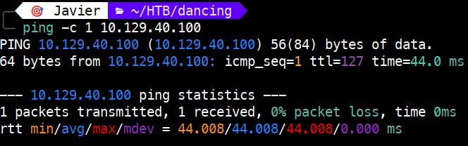 

Vemos que tenemos conectividad con la máquina y, además, el TTL nos da una pista del sistema operativo que hay detrás:

- TTL 64 → Linux
   
- TTL 128 → Windows

## 1.2. Descubrimiento de puertos 📡

```bash
nmap -p- --min-rate 5000 <IP> -v
```

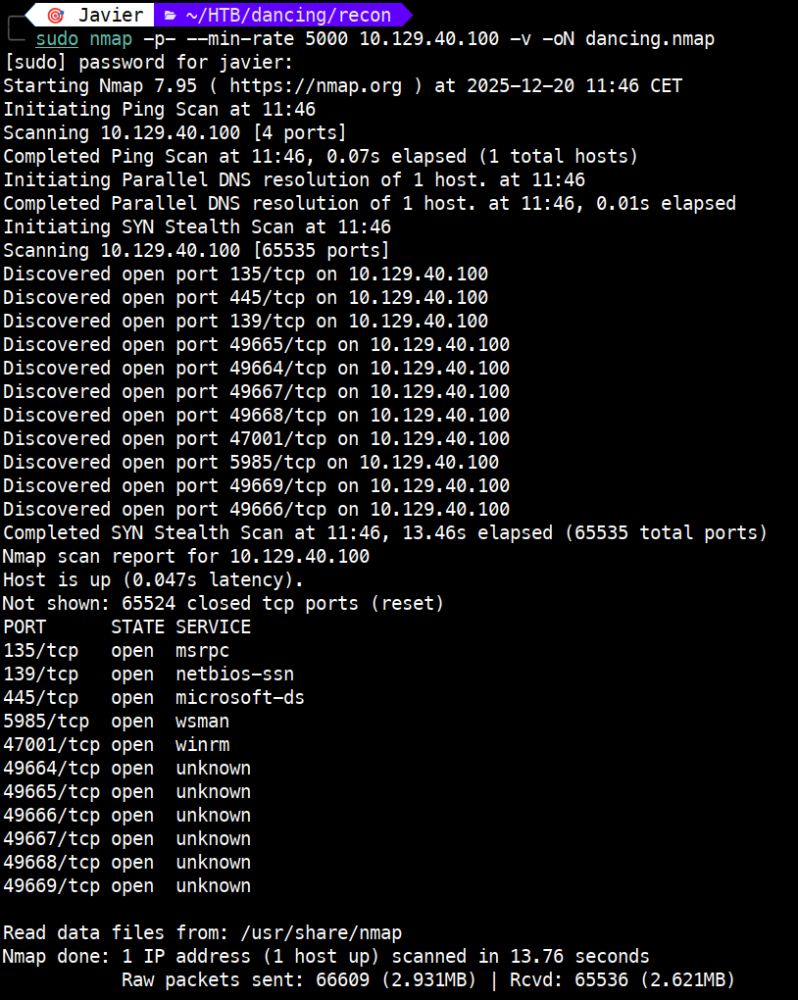 

Puertos encontrados:

| Puerto     | Estado | Servicio     | Descripción / Uso típico                                      |
|------------|--------|--------------|----------------------------------------------------------------|
| 135/tcp    | open   | msrpc        | RPC de Windows; comunicación entre procesos y servicios remotos. |
| 139/tcp    | open   | netbios-ssn  | NetBIOS; compartición de archivos/impresoras en redes antiguas. |
| 445/tcp    | open   | microsoft-ds | SMB moderno; compartición de archivos y autenticación.          |
| 5985/tcp   | open   | http (WinRM) | Administración remota vía PowerShell sobre HTTP.                |
| 47001/tcp  | open   | http (WinRM) | Puerto adicional de WinRM; gestión remota.                      |
| 49664/tcp  | open   | msrpc        | Puerto dinámico RPC; comunicación interna del sistema.          |
| 49665/tcp  | open   | msrpc        | Igual que arriba; puerto efímero RPC.                           |
| 49666/tcp  | open   | msrpc        | Igual que arriba; puerto efímero RPC.                           |
| 49667/tcp  | open   | msrpc        | Igual que arriba; puerto efímero RPC.                           |
| 49668/tcp  | open   | msrpc        | Igual que arriba; puerto efímero RPC.                           |
| 49669/tcp  | open   | msrpc        | Igual que arriba; puerto efímero RPC.                           |


## 1.3. Enumeración del servicio 🛠️

Una vez identificado el puerto y el servicio, realizamos un escaneo más detallado:

```bash
nmap -p 135,139,445,5985,47001,49664,49665,49666,49667,49668,49669 -sVC <IP>
```

**NOTA:** `-sVC` : Permite identificar la versión del servicio asociado al puerto (-sV) y ejecutar los scripts por defecto de Nmap (-sC).

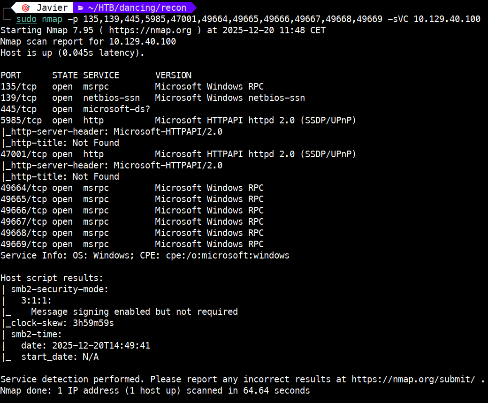

**Interpretación**

Este host parece ser:

- Un Windows o un Windows Server

- Con SMB, RPC y WinRM activos.

- Con puertos dinámicos abiertos (normal en Windows).

- Con una configuración SMB no estricta (info. obtenida del smb2-security-mode)

# 2. Explotación ⚡

Empezamos usando `enum4linux` (en base a lo visto en https://book.hacktricks.wiki/es/network-services-pentesting/pentesting-smb/index.html). Con esta herramienta intentamos recopilar:

- Usuarios
- Grupos
- Shares
- Políticas SMB
- Información del dominio
- SID bruteforce
- Información del sistema

```bash
enum4linux -a <IP>
```
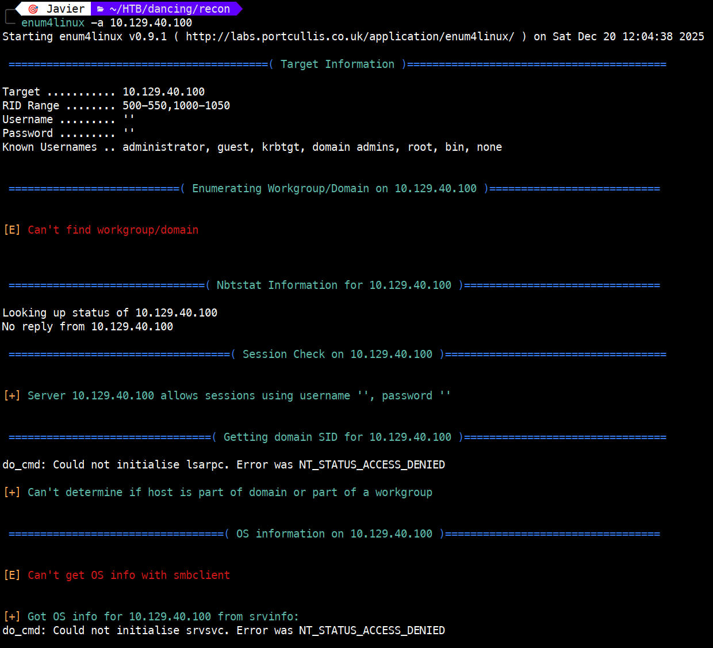

De la ejecución anterior no obtenemos nada relevante, ahora probamos con `smbclient`.

Ejecutamos el comando siguiente para listar los shares:

```bash
smbclient -N -L //<IP>
```
**NOTA:** 

`-N`: Null session

`-L`: Listado

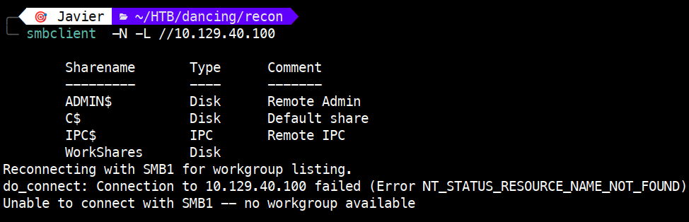

Del resultado anterior, vemos que tenemos 4 shares. Nos vamos a centrar en `WorkShares`. 

Para acceder a este share debemos ejecutar:

```bash
smbclient -N //<IP>/WorkShares
```

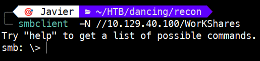

Una vez conectados, ejecutamos `help` para ver los comandos disponibles.

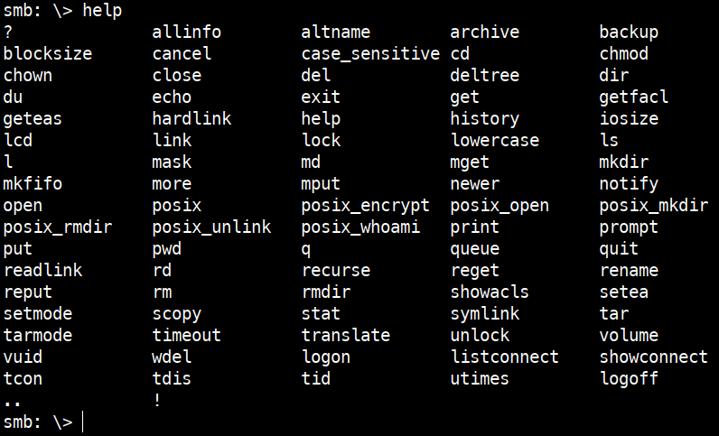

Para saber en qué directorio estamos, ejecutamos `pwd`. Esto es útil si nos movemos por los diferentes directorios del share.

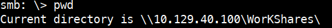

Para listar el contenido del share, ejecutamos `l`.

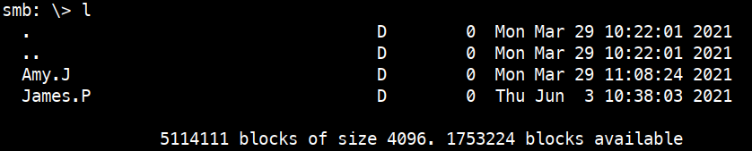

Como se aprecia, tenemos dos directorios: `Amy.J` y `James.P`. Cada uno de ellos contiene un fichero .txt; uno de ellos contiene nuestra flag.

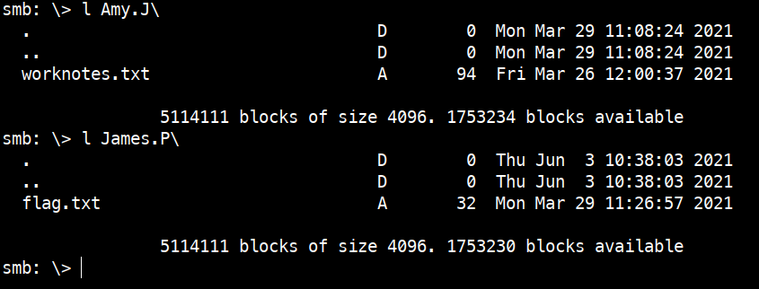

# 3. Obtención de la flag 🎉

Para descargar los ficheros a nuestra máquina ejecutaremos:

```bash
get Amy.J\worknotes.txt

get James.P\flag.txt
```

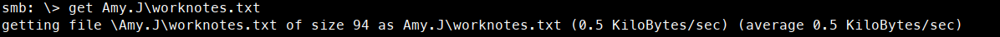

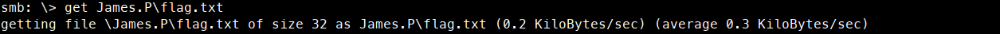

**NOTA:** En el caso de que **no** deseemos exfiltrar los ficheros, podemos ver su contenido haciendo uso de `more` tal como se muestra a continuación:

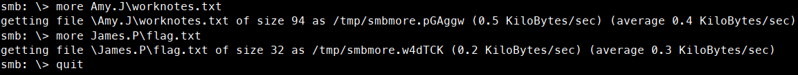

Así se ve el contenido de los ficheros `worknotes.txt` y `flag.txt`:

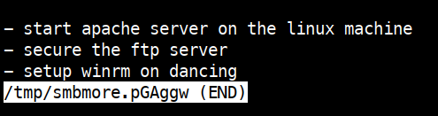

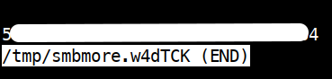

Si hemos optado por la descarga, podemos comprobar su correcta descarga y su contenido, tal como se ve en la siguiente imagen.

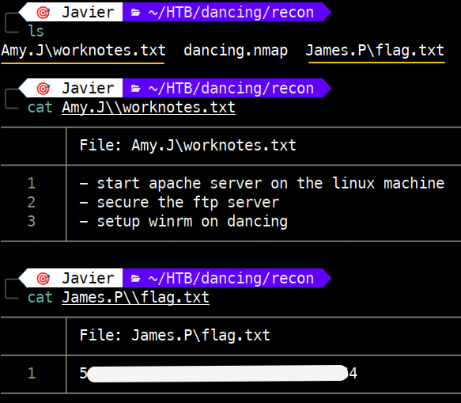

Otra manera de obtener la flag es usando la herramienta `smbmap`, que es más amigable, en lugar de `smbclient`.

Para obtener los shares con `smbmap` ejecutamos:

```bash
smbmap -H <IP> -u 'guest' -p ''
```

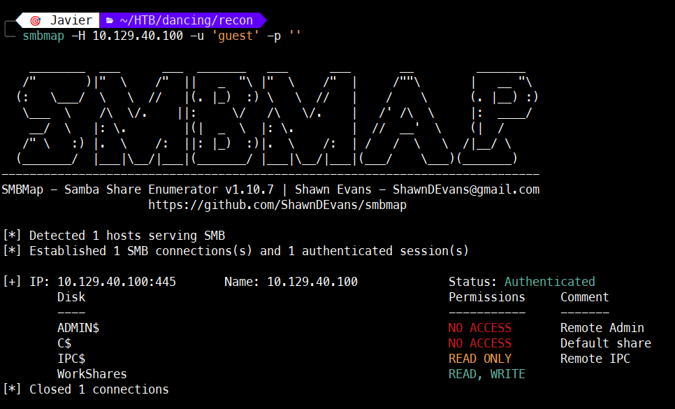

A diferencia de `smbclient`, `smbmap` nos muestra con colores los permisos, lo que facilita la tarea de saber cuáles pueden ser leídos.

Para averiguar el contenido del share, ejecutamos:

```bash
smbmap -H <IP> -u 'guest' -p '' -r WorkShares
```
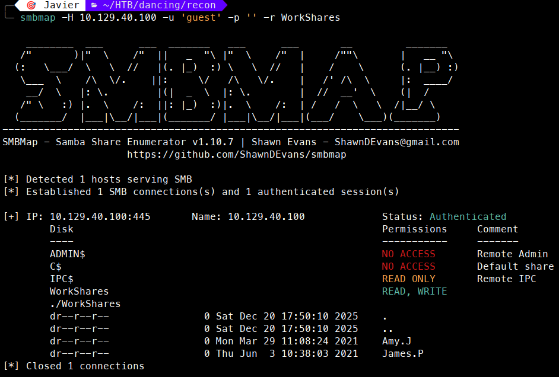

Como se aprecia, nos muestra los dos directorios anteriormente vistos.

Si queremos ver el contenido de los directorios, en este caso el de `Amy.J` ejecutaremos:

```bash
smbmap -H <IP> -u 'guest' -p '' -r WorkShares/Amy.J
```

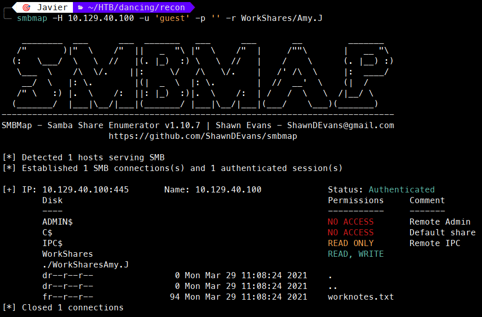

Como vemos, tenemos el fichero `worknotes.txt`.

Para descargarnos ese fichero con `smbmap`, debemos ejecutar:

```bash
smbmap -H <IP> -u 'guest' -p '' --download WorkShares/Amy.J/worknotes.txt
```
En la siguiente imagen, se muestra el proceso de descarga.

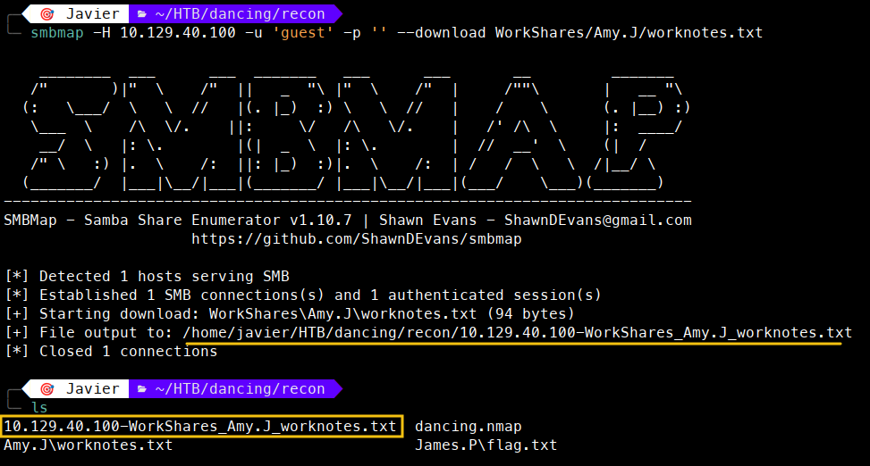

Habría que repetir los pasos anteriores para descargar el fichero `flag.txt`.

# 4. Técnicas practicadas / Lecciones aprendidas 🧩

- Uso de `ping` para validar la conectividad como primer paso de la enumeración. El valor del TTL (127 debido al salto introducido por la VPN de HTB) indica que estamos ante una máquina Windows.

- Una primera enumeración para obtención de los puertos, con nmap `-p- --min-rate`

- Una segunda enumeración, de servicios, con `nmap -sVC` que permite identificar versiones y scripts relevantes.

- Uso de `smbclient` para interactuar con shares mediante null session. O bien usar otras herramientas como `smbmap`.

- Identificación de acceso anónimo habilitado en SMB (Null Session), confirmado mediante `smbclient -N` y `smbmap` con usuario guest.

- Acceso y lectura de archivos sensibles (`flag.txt`) y validación del objetivo.

---

# 📝 Cuestionario (Tasks)

### **Task 1**

**Q:** What does the 3-letter acronym SMB stand for?

**A:** Server Message Block

### **Task 2**

**Q:** What port does SMB use to operate at?

**A:** 445

### **Task 3**

**Q:** What is the service name for port 445 that came up in our Nmap scan?

**A:** microsoft-ds

### **Task 4**

**Q:** What is the 'flag' or 'switch' that we can use with the smbclient utility to 'list' the available shares on Dancing?

**A:** -L

### **Task 5**

**Q:** How many shares are there on Dancing?

**A:** 4

### **Task 6**

**Q:** What is the name of the share we are able to access in the end with a blank password?

**A:** WorkShares

### **Task 7**

**Q:** What is the command we can use within the SMB shell to download the files we find?

**A:** get

---
