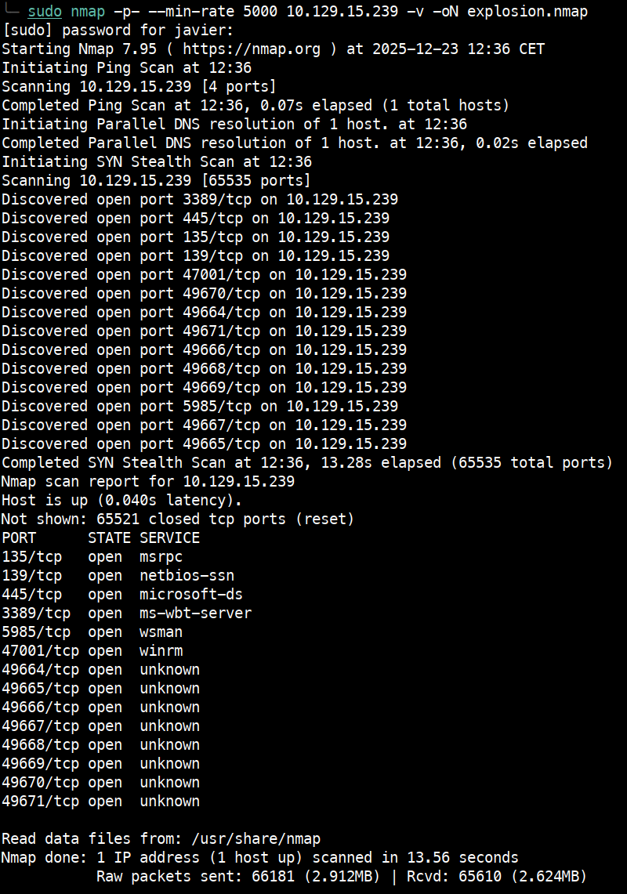
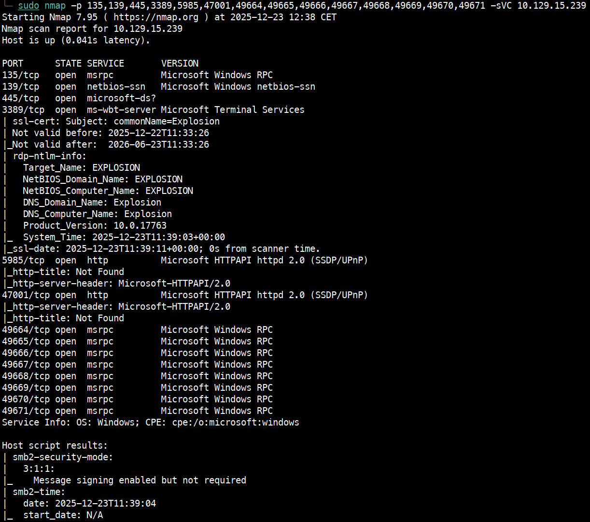
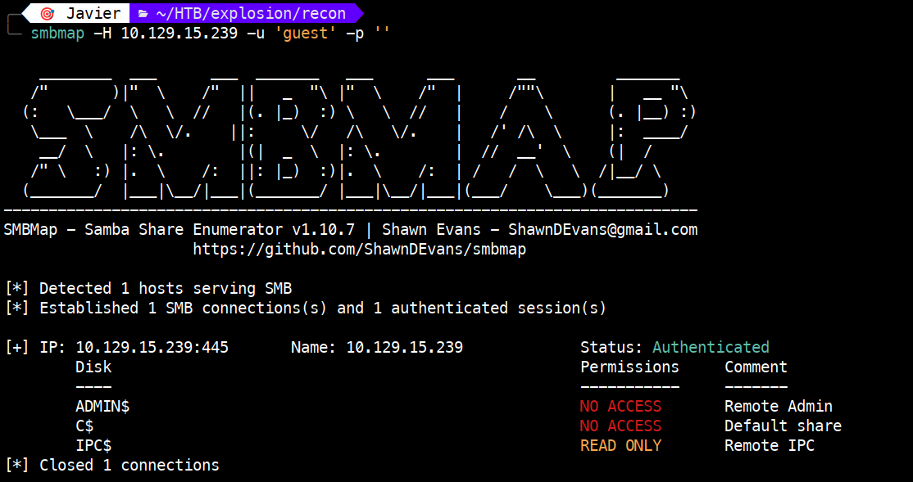
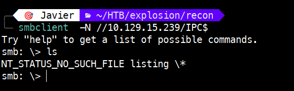
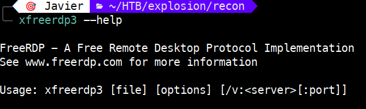
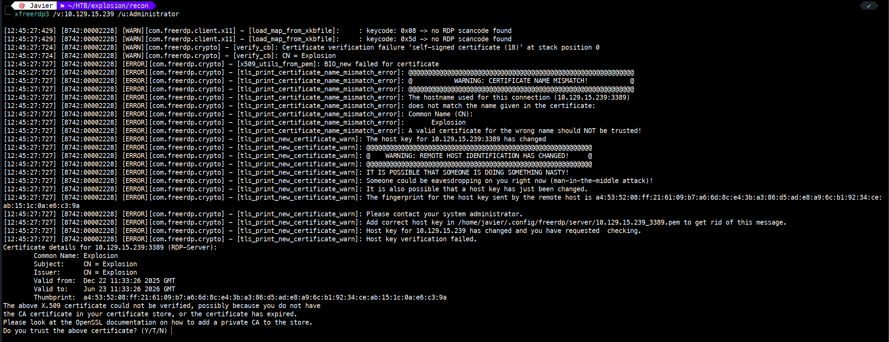
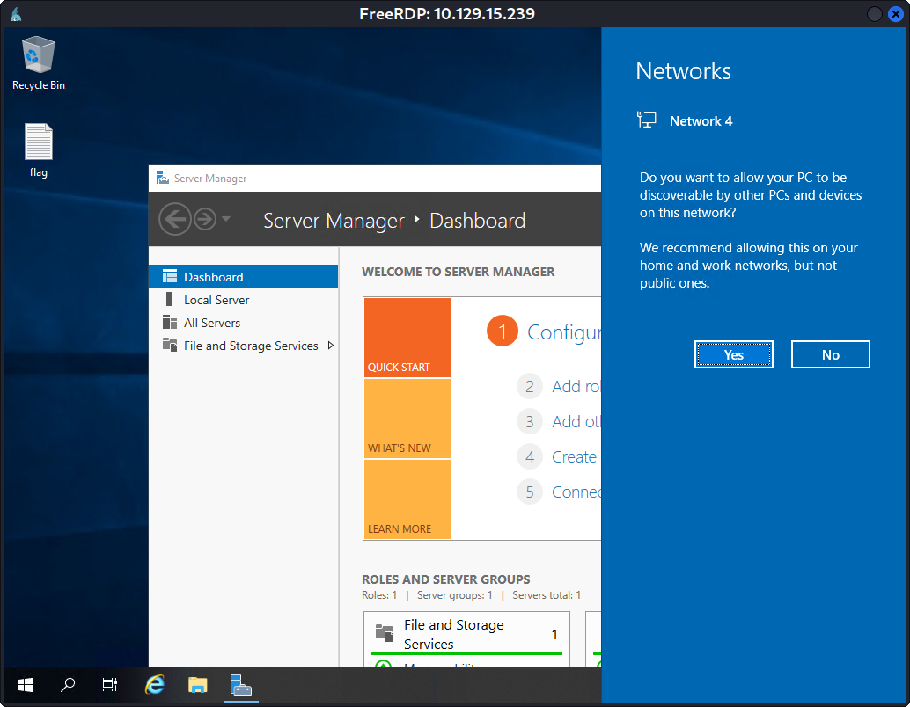

# Explosion – Tier 0

Write-up de la máquina **Explosion** perteneciente a la ruta *Starting Point* de Hack The Box.


---

# 1. Enumeración 🔍

## 1.1. Comprobación de conectividad 🌐

```bash
ping -c 1 <IP>
```

 

Vemos que tenemos conectividad con la máquina y, además, el TTL nos da una pista del sistema operativo que hay detrás:

- TTL 64 → Linux (TTL 63 si hay un salto intermedio)
   
- TTL 128 → Windows (TTL 127 si hay un salto intermedio)

## 1.2. Descubrimiento de puertos 📡

```bash
sudo nmap -p- --min-rate 5000 <IP> -v
```

 

Puertos encontrados:

| **Puerto** | **Protocolo** | **Estado** | **Servicio**         | **Explicación técnica** |
|------------|---------------|------------|-----------------------|--------------------------|
| 135        | TCP           | open       | msrpc                 | Servicio RPC usado por Windows para comunicación entre procesos y gestión remota. |
| 139        | TCP           | open       | netbios-ssn           | NetBIOS Session Service, utilizado para compartir archivos e impresoras en redes Windows. |
| 445        | TCP           | open       | microsoft-ds          | SMB sobre TCP, permite compartir archivos, impresoras y acceso remoto a recursos. |
| 3389       | TCP           | open       | ms-wbt-server (RDP)   | Protocolo de Escritorio Remoto (RDP), permite acceso gráfico remoto al sistema. |
| 5985       | TCP           | open       | wsman (WinRM)         | Windows Remote Management, usado para administración remota vía PowerShell. |
| 47001      | TCP           | open       | winrm                 | Puerto alternativo para WinRM, usado en configuraciones específicas de administración remota. |
| 49664      | TCP           | open       | unknown               | Puerto dinámico RPC, asignado por el sistema para servicios como DCOM o WMI. |
| 49665      | TCP           | open       | unknown               | Otro puerto dinámico RPC, parte del rango reservado por Windows. |
| 49666      | TCP           | open       | unknown               | Similar al anterior, usado por servicios internos de Windows. |
| 49667      | TCP           | open       | unknown               | Puerto RPC dinámico, puede estar asociado a servicios como Remote Procedure Call. |
| 49668      | TCP           | open       | unknown               | Parte del rango de puertos efímeros usados por Windows para servicios RPC. |
| 49669      | TCP           | open       | unknown               | Asignado dinámicamente por el sistema operativo para procesos internos. |
| 49670      | TCP           | open       | unknown               | Puerto efímero RPC, puede estar vinculado a servicios como WMI o DCOM. |
| 49671      | TCP           | open       | unknown               | Último puerto del rango detectado, reservado para comunicación interna de servicios. |

## 1.3. Enumeración del servicio 🛠️

Una vez identificados los puertos y servicios, realizamos un escaneo más detallado:

```bash
sudo nmap -p 135,139,445,3389,5985,47001,49664,49665,49666,49667,49668,49669,49670,49671 -sVC <IP>
```

**NOTA:** `-sVC`: Permite identificar la versión del servicio asociado al puerto (-sV) y ejecutar los scripts por defecto de Nmap (-sC).



**Interpretación**

Este host parece ser:

- Un sistema Windows o Windows Server, algo que se confirma tanto por los servicios detectados (SMB, RPC, RDP, WinRM) como por el TTL observado en el ping, característico de este tipo de sistemas.

- Con servicios de administración remota habilitados, concretamente RDP (3389) y WinRM (5985/47001), lo que indica que la máquina está preparada para gestión remota mediante PowerShell o Escritorio Remoto.

- Con SMB y NetBIOS activos (puertos 139 y 445), lo que permite la enumeración de recursos compartidos, sesiones y potencialmente usuarios del dominio o del sistema.

- Con RPC operativo (135 + puertos dinámicos 49664–49671), algo completamente normal en sistemas Windows modernos, ya que RPC asigna puertos efímeros para servicios internos como WMI o DCOM.

- Con un rango amplio de puertos dinámicos abiertos, lo cual refuerza la idea de que el sistema está ejecutando múltiples servicios internos basados en RPC.

- Con una configuración de red orientada a administración, ya que WinRM y RDP no suelen estar habilitados simultáneamente a menos que la máquina esté diseñada para ser gestionada remotamente.

# 2. Explotación ⚡

Dado que el puerto 445 está abierto, vamos a comprobar qué shares están disponibles. Para ello, ejecutamos:

```bash
smbmap -H <IP> -u 'guest' -p ''
```



Vemos que IPC$ está en modo solo lectura. Vamos a revisar si contiene algo de interés. Para ello, ejecutamos:

```bash
smbclient -N //<IP>/IPC$
ls
```



El directorio no contiene nada, así que vamos a continuar con la explotación. Dejaremos de lado WinRM y nos centraremos en RDP, que es el servicio requerido para completar el reto.

Vamos a hacer uso de la herramienta `xfreerdp3` para conectarnos por RDP. Para ver cómo usar el comando, ejecutamos `xfreerdp3 --help`.




# 3. Obtención de la flag 🎉

Para obtener la flag, debemos conectarnos por RDP ejecutando:

```bash
xfreerdp3 /v:<IP> /u:Administrator
```
**Nota:** Según la ayuda, sería más correcto usar `xfreerdp3 /u:Administrator /v:<IP>` 



Una vez conectados por RDP, la flag se encuentra en un archivo del escritorio.



# 4. Técnicas practicadas / Lecciones aprendidas 🧩

- Uso de `ping` para validar la conectividad como primer paso de la enumeración. El valor del TTL también nos orienta sobre el sistema operativo remoto, en este caso Windows.

- Una primera enumeración para la obtención de los puertos, con `nmap -p- --min-rate`

- Una segunda enumeración de servicios, con `nmap -sVC` que permite identificar versiones y scripts relevantes.

- Descubrimiento de puertos WinRM, SMB, RDP...

- Practicar con `smbmap` para ver shares y con `smbclient` para acceder a su contenido.

- Uso de la herramienta `xfreerdp3` para conectarnos en remoto.

- Obtención de la flag tras acceder mediante RDP.

---

# 📝 Cuestionario (Tasks)

### **Task 1**

**Q:** What does the 3-letter acronym RDP stand for?

**A:** Remote Desktop Protocol

### **Task 2**

**Q:** What is a 3-letter acronym that refers to interaction with the host through a command line interface?

**A:** CLI

### **Task 3**

**Q:** What about graphical user interface interactions?

**A:** GUI

### **Task 4**

**Q:** What is the name of an old remote access tool that came without encryption by default and listens on TCP port 23?

**A:** telnet

### **Task 5**

**Q:** What is the name of the service running on port 3389 TCP?

**A:** ms-wbt-server

### **Task 6**

**Q:** What is the switch used to specify the target host's IP address when using xfreerdp?

**A:** /v:

### **Task 7**

**Q:** What username successfully returns a desktop projection to us with a blank password?

**A:** Administrator