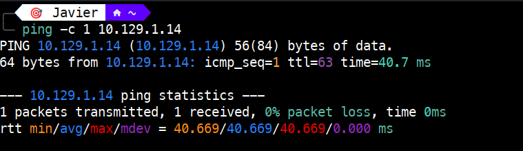
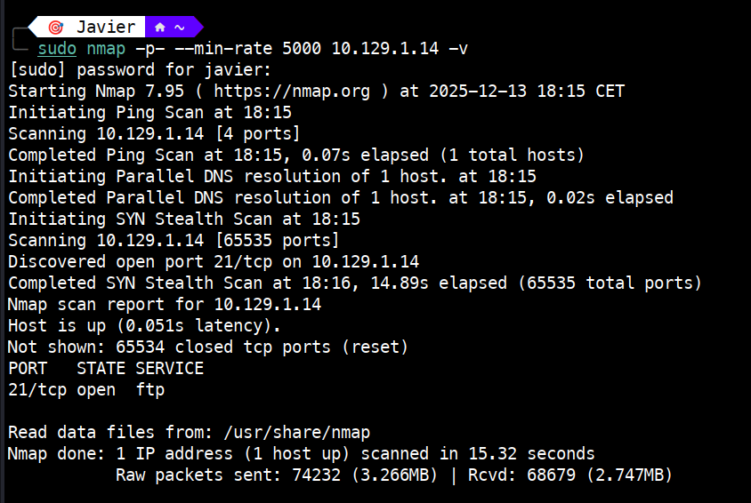
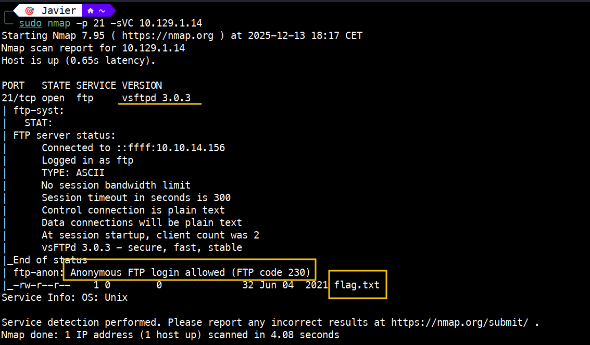
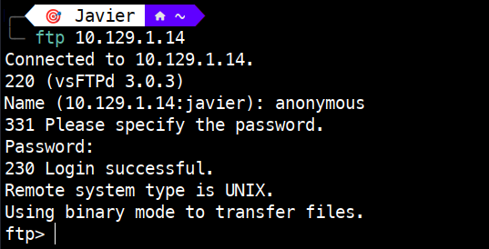
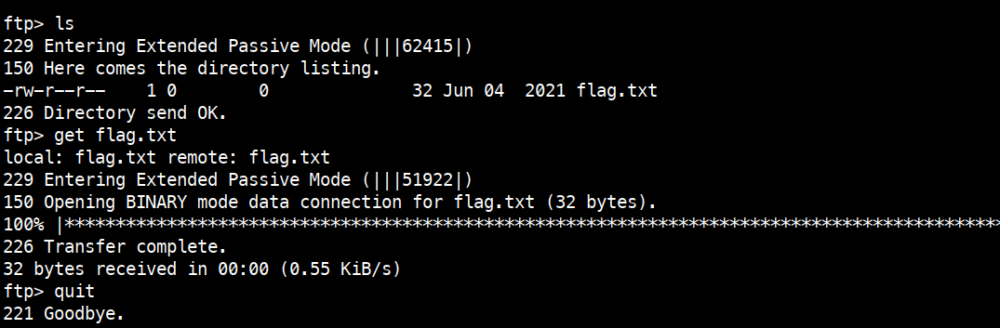
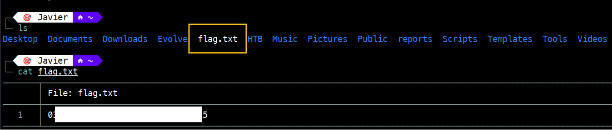

# Fawn – Tier 0

Write-up de la máquina **Fawn** perteneciente a la ruta *Starting Point* de Hack The Box.


---

# 1. Enumeración 🔍

## 1.1. Comprobación de conectividad 🌐

```bash
ping -c 1 <IP>
```

 

Vemos que tenemos conectividad con la máquina y, además, el TTL nos da una pista del sistema operativo que hay detrás:

- TTL 64 → Linux
   
- TTL 128 → Windows

## 1.2. Descubrimiento de puertos 📡

```bash
nmap -p- --min-rate 5000 <IP> -v
```

 

Puerto encontrado:

21/tcp → open → ftp

## 1.3. Enumeración del servicio 🛠️

Una vez identificado el puerto y el servicio, realizamos un escaneo más detallado:

```bash
nmap -sVC -p 21 <IP>
```

**NOTA:** `-sVC` : Permite identificar la versión del servicio asociado al puerto (-sV) y ejecutar los scripts por defecto de Nmap (-sC).



Del resultado anterior, obtenemos la siguiente información:

- El servicio ftp está en la **versión** `vsftpd 3.0.3`

- El **FTP anónimo** está **permitido** (**NOTA:** El `FTP code 230` indica User logged in, proceed)

- Vemos el **contenido del directorio**, fichero `flag.txt`

# 2. Explotación ⚡

Teniendo la versión, podemos comprobar si `vsftpd 3.0.3` tiene algún CVE o exploit asociado. En este caso, no es necesario, ya que está habilitado el acceso anónimo.

Accedemos con **usuario** y **contraseña** `anonymous` o bien `ftp`:

```bash
ftp <IP>
```


**NOTA:** Otra forma de acceder sin tener que poner las credenciales: `ftp -a <IP>`

# 3. Obtención de la flag 🎉

Listamos el contenido del directorio (`ls`) y vemos que contiene `flag.txt`. Procedemos a descargarlo con `get` y salimos del ftp (`quit`)

	

Listamos el contenido de nuestro directorio (`ls`) para verificar que el fichero se ha descargado correctamente y procedemos a visualizarlo con:

```bash
cat flag.txt
```


# 4. Técnicas practicadas / Lecciones aprendidas 🧩

- Uso de `ping` para validar la conectividad como primer paso de la enumeración. El valor del TTL (63, debido al salto introducido por la VPN de HTB) indica que estamos ante una máquina Linux.

- Escaneo completo de puertos con nmap `-p- --min-rate` para obtener un mapa rápido del objetivo.

- Enumeración de servicios con `nmap -sVC` que permite identificar versiones y scripts relevantes.

- Identificación de FTP como servicio expuesto y potencialmente vulnerable.

- Acceso anónimo habilitado.

- Acceso y lectura de ficheros sensibles (`flag.txt`) y validación del objetivo.

---

# 📝 Cuestionario (Tasks)

### **Task 1**

**Q:** What does the 3-letter acronym FTP stand for?

**A:** File Transfer Protocol

### **Task 2**

**Q:** Which port does the FTP service listen on usually?

**A:** 21

### **Task 3**

**Q:** FTP sends data in the clear, without any encryption. What acronym is used for a later protocol designed to provide similar functionality to FTP but securely, as an extension of the SSH protocol?

**A:** SFTP

### **Task 4**

**Q:** What is the command we can use to send an ICMP echo request to test our connection to the target?

**A:** ping

### **Task 5**

**Q:** From your scans, what version is FTP running on the target?

**A:** vsftpd 3.0.3

### **Task 6**

**Q:** From your scans, what OS type is running on the target?

**A:** Unix

### **Task 7**

**Q:** What is the command we need to run in order to display the 'ftp' client help menu?

**A:** ftp -?

### **Task 8**

**Q:** What is username that is used over FTP when you want to log in without having an account?

**A:** anonymous

### **Task 9**

**Q:** What is the response code we get for the FTP message 'Login successful'?

**A:** 230

### **Task 10**

**Q:** There are a couple of commands we can use to list the files and directories available on the FTP server. One is dir. What is the other that is a common way to list files on a Linux system.

**A:** ls

### **Task 11**

**Q:** What is the command used to download the file we found on the FTP server?

**A:** get

---
