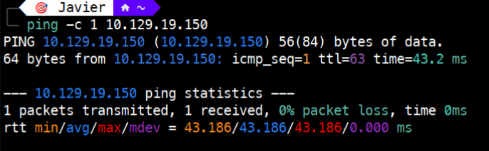
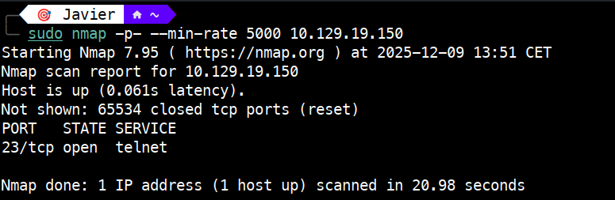
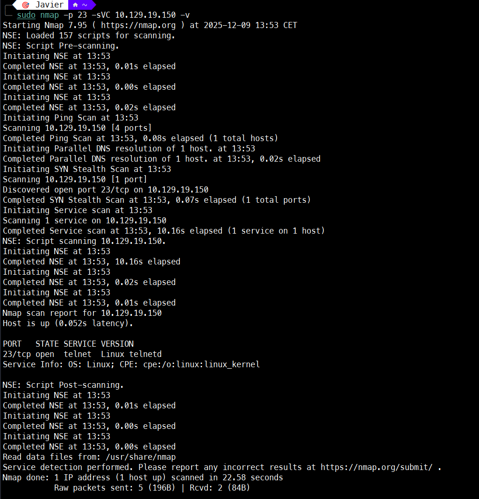
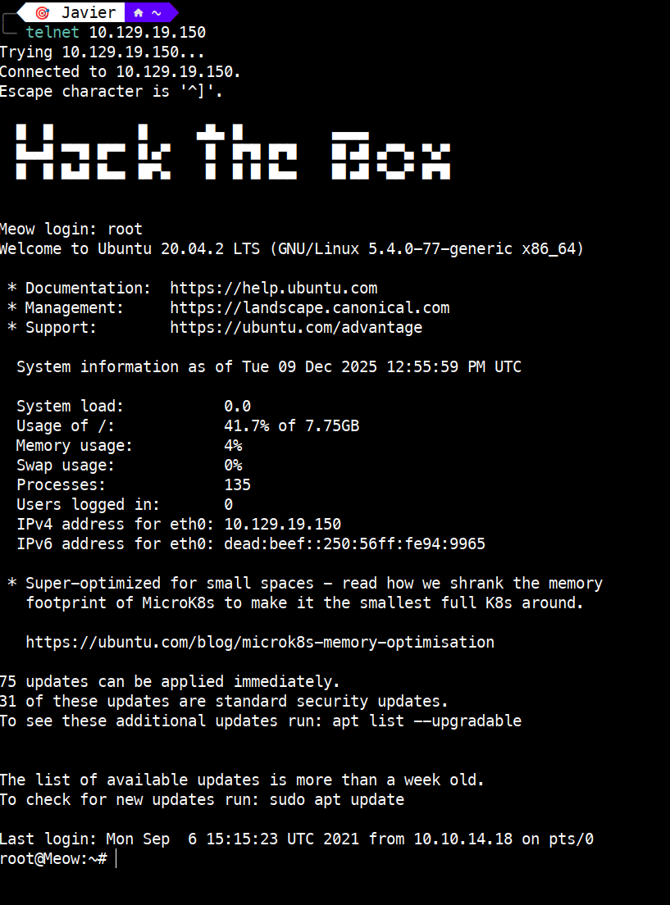
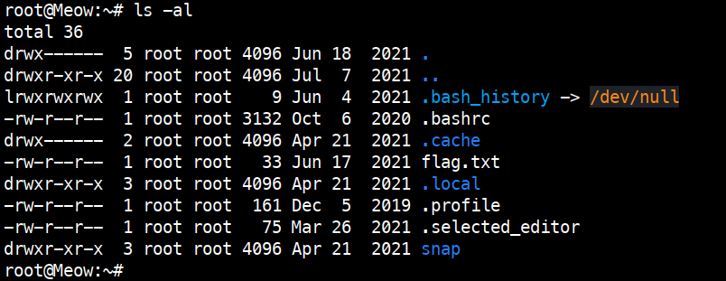
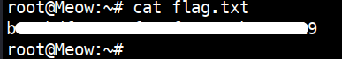

# Meow – Tier 0

Write-up de la máquina **Meow** perteneciente a la ruta *Starting Point* de Hack The Box.


---

# 1. Enumeración 🔍

## 1.1. Comprobación de conectividad 🌐

```bash
ping -c 1 <IP>
```

 

Vemos que tenemos conectividad con la máquina y, además, el TTL nos da una pista del sistema operativo que hay detrás:

- TTL 64 → Linux
   
- TTL 128 → Windows

## 1.2. Descubrimiento de puertos 📡

```bash
sudo nmap -p- --min-rate 5000 <IP>
```

 

Puerto encontrado:

23/tcp → open

## 1.3. Enumeración del servicio 🛠️

Una vez identificado el puerto, realizamos un escaneo más detallado:

```bash
sudo nmap -sVC -p 23 <IP>
```



# 2. Explotación ⚡

Acceso por Telnet con usuario root y contraseña en blanco:

```bash
telnet <IP>
```


# 3. Obtención de la flag 🎉

Listamos el contenido del directorio:

```bash
ls -al
```
	

Encontrado el fichero que contiene la flag (`flag.txt`), procedemos a ver el contenido:

```bash
cat flag.txt
```


# 4. Técnicas practicadas / Lecciones aprendidas 🧩

- Uso de `ping` para validar la conectividad como primer paso de la enumeración. El valor del TTL también nos orienta sobre el sistema operativo remoto.

- Escaneo completo de puertos con `nmap -p- --min-rate` para obtener un mapa rápido del objetivo.

- Enumeración de servicios con `nmap -sVC` para identificar versiones y scripts relevantes.

- Identificación de Telnet como servicio expuesto y potencialmente vulnerable.

- Prueba de autenticación débil (root sin contraseña).

- Acceso remoto mediante Telnet y navegación básica del sistema.

- Lectura de ficheros sensibles (`flag.txt`) y validación del objetivo.

---

# 📝 Cuestionario (Tasks)

### **Task 1**

**Q:** What does the acronym VM stand for?  

**A:** Virtual Machine

### **Task 2**

**Q:** What tool do we use to interact with the operating system in order to issue commands via the command line, such as the one to start our VPN connection? It's also known as a console or shell.  

**A:** terminal

### **Task 3**

**Q:** What service do we use to form our VPN connection into HTB labs?  

**A:** openvpn

### **Task 4**

**Q:** What tool do we use to test our connection to the target with an ICMP echo request?  

**A:** ping

### **Task 5**

**Q:** What is the name of the most common tool for finding open ports on a target?  

**A:** nmap

### **Task 6**

**Q:** What service do we identify on port 23/tcp during our scans?  

**A:** telnet

### **Task 7**

**Q:** What username is able to log into the target over telnet with a blank password?  

**A:** root

---
