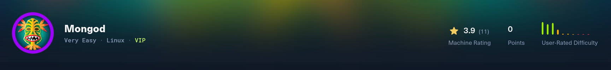
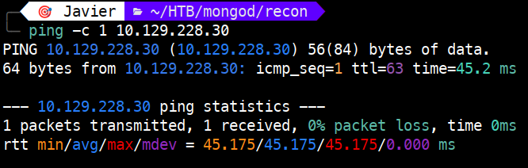
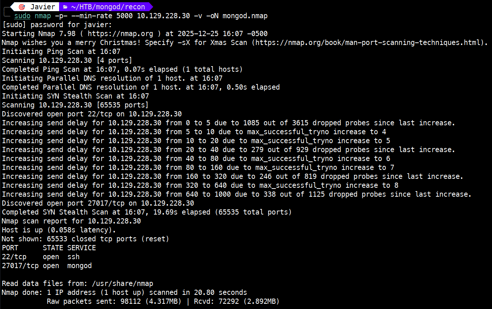
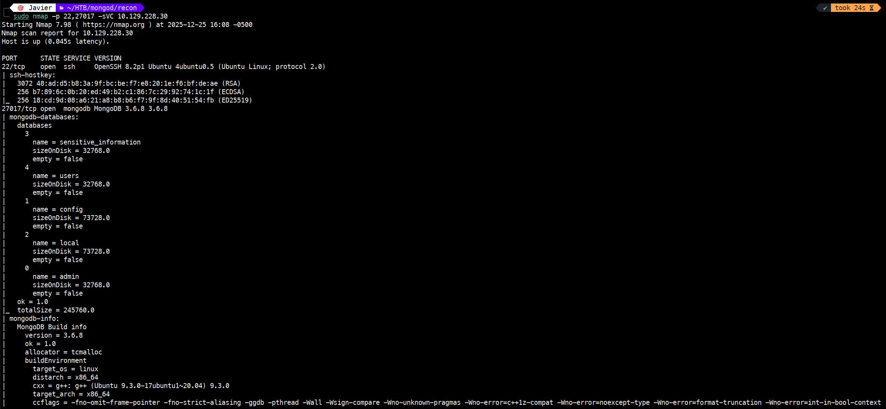
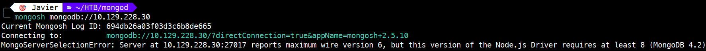
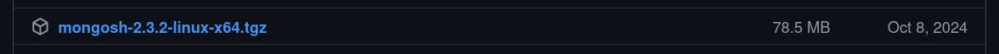
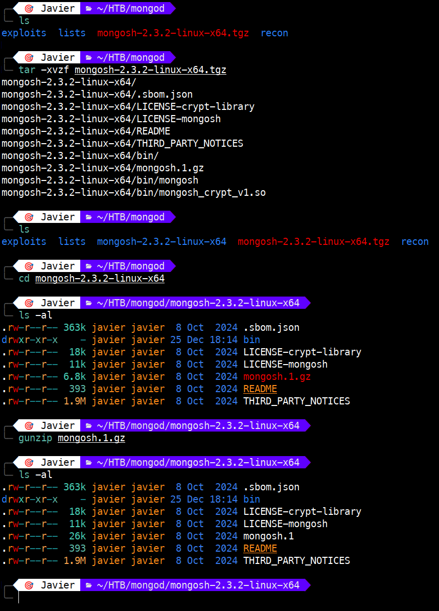
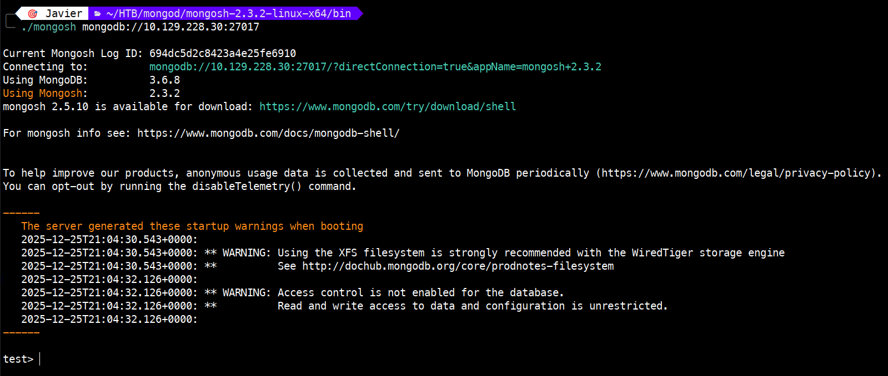
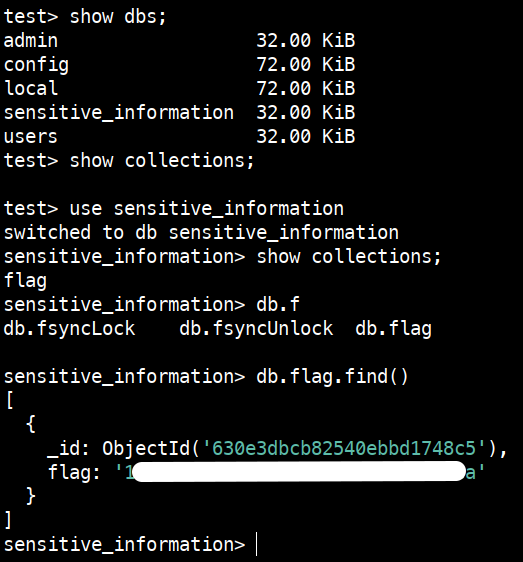

# Mongod – Tier 0

Write-up de la máquina **Mongod** perteneciente a la ruta *Starting Point* de Hack The Box.



---

# 1. Enumeración 🔍

## 1.1. Comprobación de conectividad 🌐

```bash
ping -c 1 <IP>
```

 

Vemos que tenemos conectividad con la máquina y, además, el TTL nos da una pista del sistema operativo que hay detrás:

- TTL 64 → Linux (TTL 63 si hay un salto intermedio)
   
- TTL 128 → Windows (TTL 127 si hay un salto intermedio)

## 1.2. Descubrimiento de puertos 📡

```bash
sudo nmap -p- --min-rate 5000 <IP> -v
```

 

Puertos encontrados:

- 22/tcp → open → ssh

- 27017/tcp → open → mongod

## 1.3. Enumeración del servicio 🛠️

Una vez identificados los puertos y servicios, realizamos un escaneo más detallado:

```bash
sudo nmap -p 22,27017 -sVC <IP>
```

**NOTA:** `-sVC`: Permite identificar la versión del servicio asociado al puerto (-sV) y ejecutar los scripts por defecto de Nmap (-sC).



De la ejecución anterior identificamos que estamos ante un MongoDB v3.6.8 accesible sin autenticación, y además vemos la estructura interna. Podemos apreciar 5 bases de datos, de las cuales dos son bastante interesantes: `users` y `sensitive_information`.

# 2. Explotación ⚡

Para conectarnos usaremos `mongosh`, pero **ojo**, no vale cualquier versión. Este reto de HTB requiere una versión antigua; si descargamos una versión reciente, veremos lo siguiente:

 

Debemos descargar la [versión 2.3.2](https://github.com/mongodb-js/mongosh/releases/tag/v2.3.2) 


 

Una vez descargado el archivo, deberemos seguir los siguientes pasos para obtener el ejecutable:

```bash
tar -xvzf mongosh-2.3.2-linux.x64.tgz

cd mongosh-2.3.2-linux-x64

gunzip mongosh.1.gz
```

 

Para conectarnos a MongoDB ejecutaremos:

```bash
./mongosh mongodb://<IP>:27017
```

 

# 3. Obtención de la flag 🎉

Una vez conectados, vamos a ver las bases de datos que tenemos (`show dbs;`) y las colecciones (`show collections;`)

Se confirman las 5 bases de datos identificadas previamente en la enumeración; sin embargo, no se visualizan colecciones de forma inmediata.

Seleccionamos con `use` la base de datos `sensitive_information` y comprobamos si esta tiene alguna colección. Identificamos una colección llamada `flag` y, para ver su contenido, ejecutamos el siguiente comando con el que obtenemos la flag requerida: `db.flag.find()`.



# 4. Técnicas practicadas / Lecciones aprendidas 🧩

- Uso de `ping` para validar la conectividad como primer paso de la enumeración. El valor del TTL también nos orienta sobre el sistema operativo remoto.

- Una primera enumeración para la obtención de los puertos, con `nmap -p- --min-rate`.

- Una segunda enumeración de servicios, con `nmap -sVC` que permite identificar versiones y scripts relevantes.

- Resolución de conflictos de compatibilidad de software mediante el uso de versiones heredadas (legacy) de mongosh.

- # 4. Técnicas practicadas / Lecciones aprendidas 🧩

- Uso de `ping` para validar la conectividad como primer paso de la enumeración. El valor del TTL también nos orienta sobre el sistema operativo remoto.

- Una primera enumeración para la obtención de los puertos, con `nmap -p- --min-rate`.

- Una segunda enumeración de servicios, con `nmap -sVC` que permite identificar versiones y scripts relevantes.

- Resolución de conflictos de compatibilidad de software mediante el uso de versiones heredadas (legacy) de mongosh.

- Explotación de una Configuración de Seguridad Incorrecta (**Security Misconfiguration**). El servicio de base de datos carece de mecanismos de autenticación, permitiendo el acceso total de forma predeterminada.
---

# 📝 Cuestionario (Tasks)

### **Task 1**

**Q:** How many TCP ports are open on the machine?

**A:** 2

### **Task 2**

**Q:** Which service is running on port 27017 of the remote host?

**A:** MongoDB 3.6.8

### **Task 3**

**Q:** What type of database is MongoDB? (Choose: SQL or NoSQL)

**A:** NoSQL

### **Task 4**

**Q:**  What command is used to launch the interactive MongoDB shell from the terminal?

**A:** mongosh

### **Task 5**

**Q:** What is the command used for listing all the databases present on the MongoDB server? (No need to include a trailing ;)

**A:** show dbs

### **Task 6**

**Q:**  What is the command used for listing out the collections in a database? (No need to include a trailing ;)

**A:** show collections

### **Task 7**

**Q:**  What command is used to dump the content of all the documents within the collection named flag?

**A:** db.flag.find()
