# Preignition – Tier 0

Write-up de la máquina **Preignition** perteneciente a la ruta *Starting Point* de Hack The Box.

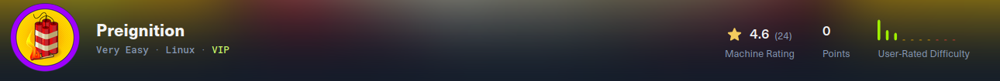

---

# 1. Enumeración 🔍

## 1.1. Comprobación de conectividad 🌐

```bash
ping -c 1 <IP>
```

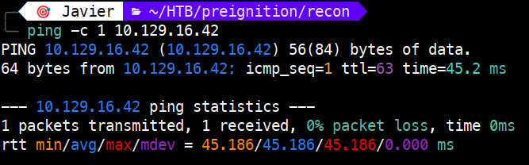 

Vemos que tenemos conectividad con la máquina y, además, el TTL nos da una pista del sistema operativo que hay detrás:

- TTL 64 → Linux (TTL 63 si hay un salto intermedio)
   
- TTL 128 → Windows (TTL 127 si hay un salto intermedio)

## 1.2. Descubrimiento de puertos 📡

```bash
sudo nmap -p- --min-rate 5000 <IP> -v
```

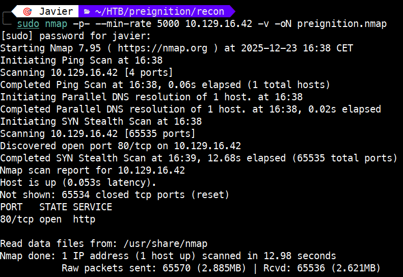 

Puertos encontrados:

80/tcp → open → http

## 1.3. Enumeración del servicio 🛠️

Una vez identificados los puertos y servicios, realizamos un escaneo más detallado:

```bash
sudo nmap -p 80 -sVC <IP>
```

**NOTA:** `-sVC`: Permite identificar la versión del servicio asociado al puerto (-sV) y ejecutar los scripts por defecto de Nmap (-sC).

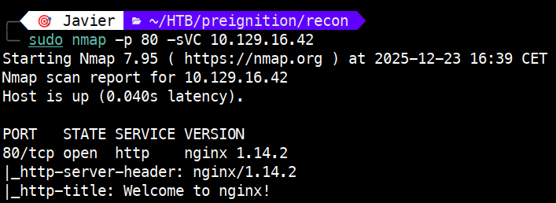

# 2. Explotación ⚡

La enumeración previa revela que el puerto 80 expone un servicio HTTP correspondiente a nginx 1.14.2.

Al revisar vulnerabilidades asociadas a esta versión, comprobamos que está afectada por el CVE‑2019‑20372. Por ello, evaluamos la posibilidad de explotación. Este CVE solo es explotable si ciertas configuraciones de error_page permiten el tráfico no autorizado de peticiones HTTP.

Probé un POC (Proof of Concept) para este CVE. El script detecta correctamente la versión y la marca como potencialmente vulnerable, pero no consigue explotarla. Esto confirma que la máquina no cumple las condiciones necesarias para que el CVE sea efectivo.

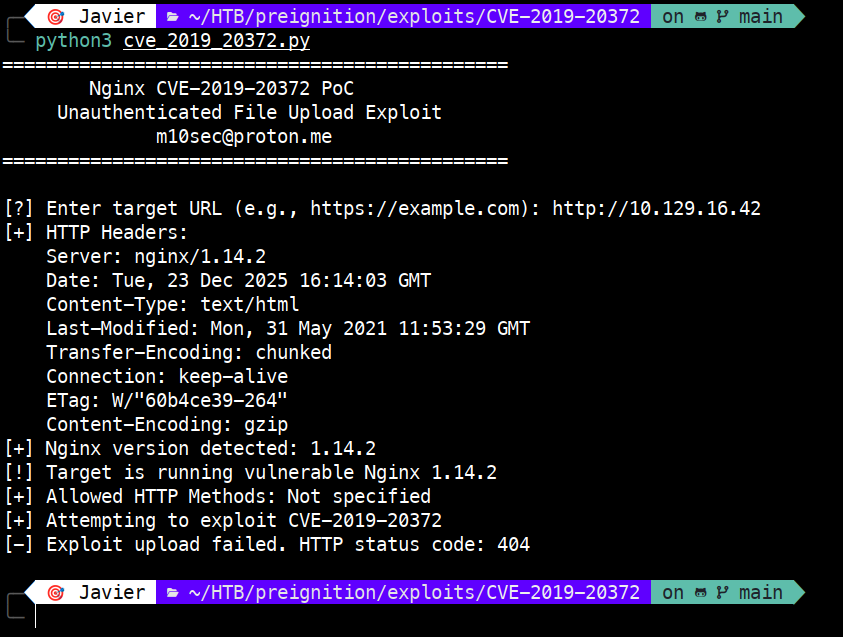

El siguiente paso es abrir el navegador y comprobar qué contenido se sirve. Se carga la página por defecto de Nginx, algo que ya habíamos visto en la enumeración previa gracias al http_title.

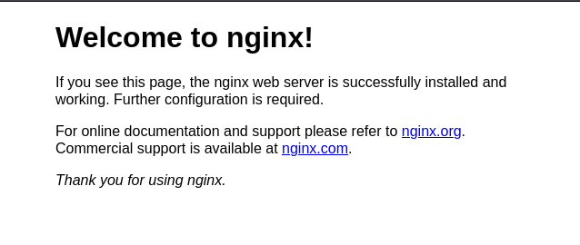

Ahora vamos a continuar con un *directory brute-forcing* sobre la URL para identificar qué directorios y ficheros pueden estar accesibles.

En este punto podemos utilizar cualquier herramienta, aunque en este reto HTB nos orienta hacia gobuster por el tipo de preguntas planteadas.

Para ver la ayuda de gobuster para listar directorios: `gobuster dir --help`

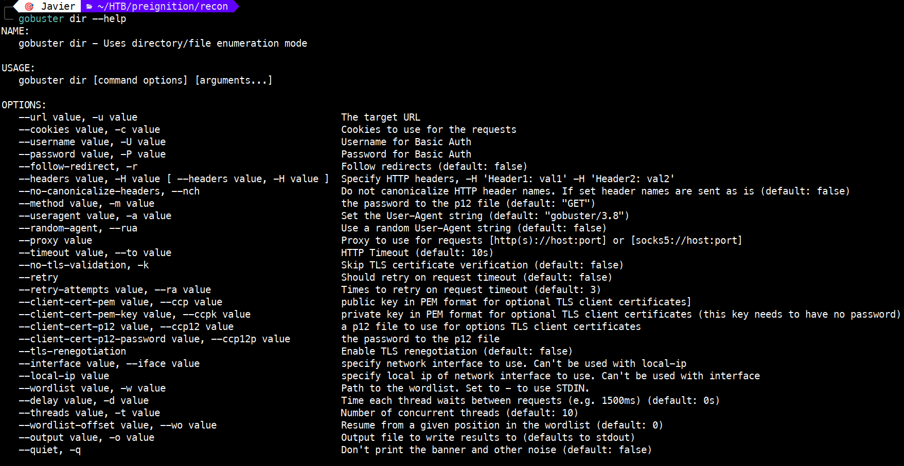

Para realizar el *directory brute-forcing* y enumerar posibles directorios y ficheros accesibles, ejecutaremos:

```bash
gobuster dir -u <URL> -w /usr/share/wordlist/dirbuster/directory-list-2.3-medium.txt -x php -t 16
```

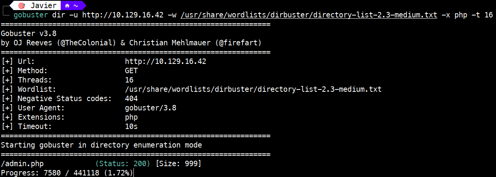

En el comando anterior, usamos la opción `-x` para que nos busque extensiones de ficheros.

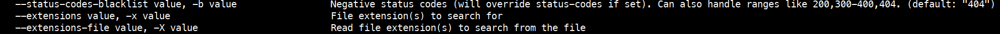

En caso de usar feroxbuster, debemos ejecutar: `feroxbuster --url <URL>`

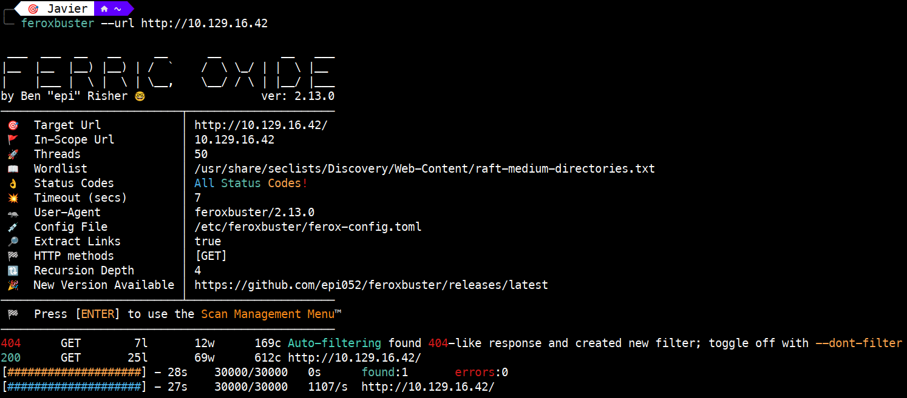

A partir del resultado anterior identificamos la ruta `/admin.php`.

Si en el navegador abrimos `http://IP/admin.php` nos aparecerá una consola de login.

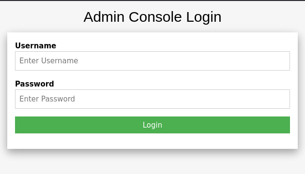

Haciendo una búsqueda en Google por "nginx default credentials" obtenemos que estas son `admin/admin`.

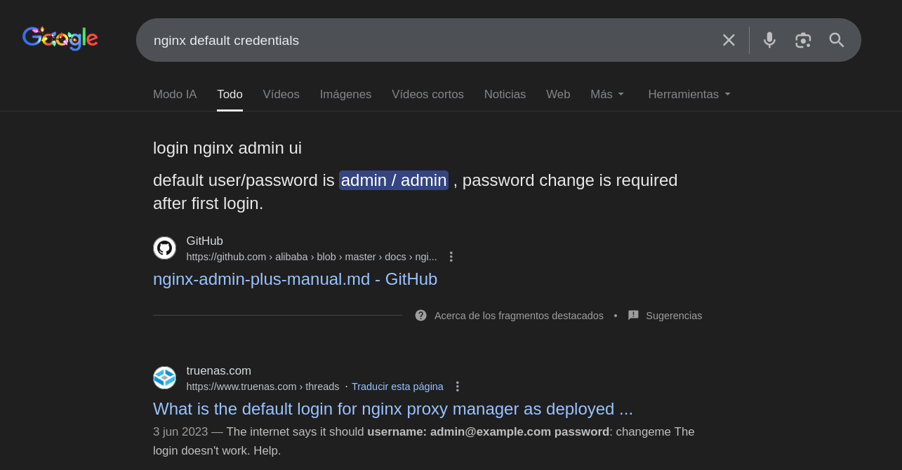

Esta información también está en la documentación oficial.

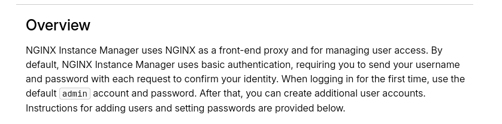

# 3. Obtención de la flag 🎉

Con iniciar sesión, ya obtenemos la flag.


# 4. Técnicas practicadas / Lecciones aprendidas 🧩

- Uso de `ping` para validar la conectividad como primer paso de la enumeración. El valor del TTL también nos orienta sobre el sistema operativo remoto.

- Una primera enumeración para la obtención de los puertos, con `nmap -p- --min-rate`.

- Una segunda enumeración de servicios, con `nmap -sVC` que permite identificar versiones y scripts relevantes.

- El uso de exploits no garantiza la explotación. Se tienen que dar las condiciones.

- *Directory brute-forcing* (dir busting) con gobuster y feroxbuster para descubrir directorios y ficheros ocultos.

- Uso de credenciales por defecto para iniciar sesión.

---

# 📝 Cuestionario (Tasks)

### **Task 1**

**Q:** Directory Brute-forcing is a technique used to check a lot of paths on a web server to find hidden pages. Which is another name for this? (i) Local File Inclusion, (ii) dir busting, (iii) hash cracking

**A:** dir busting

### **Task 2**

**Q:** What switch do we use for nmap's scan to specify that we want to perform version detection

**A:** -sV

### **Task 3**

**Q:** What does Nmap report is the service identified as running on port 80/tcp?

**A:** http

### **Task 4**

**Q:** What server name and version of service is running on port 80/tcp?

**A:** nginx 1.14.2

### **Task 5**

**Q:** What switch do we use to specify to Gobuster we want to perform dir busting specifically?

**A:** dir

### **Task 6**

**Q:** When using gobuster to dir bust, what switch do we add to make sure it finds PHP pages?

**A:** -x php

### **Task 7**

**Q:** What page is found during our dir busting activities?

**A:** admin.php

**Q:** What is the HTTP status code reported by Gobuster for the discovered page?

**A:** 200