# Redeemer – Tier 0

Write-up de la máquina **Redeemer** perteneciente a la ruta *Starting Point* de Hack The Box.

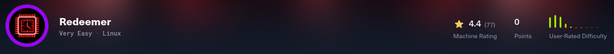

---

# 1. Enumeración 🔍

## 1.1. Comprobación de conectividad 🌐

```bash
ping -c 1 <IP>
```

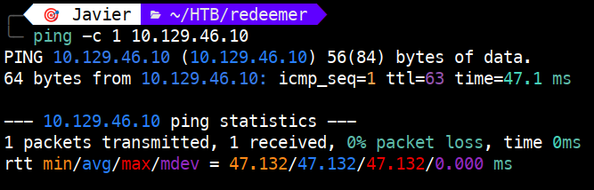 

Vemos que tenemos conectividad con la máquina y, además, el TTL nos da una pista del sistema operativo que hay detrás:

- TTL 64 → Linux
   
- TTL 128 → Windows

## 1.2. Descubrimiento de puertos 📡

```bash
sudo nmap -p- --min-rate 5000 <IP> -v
```

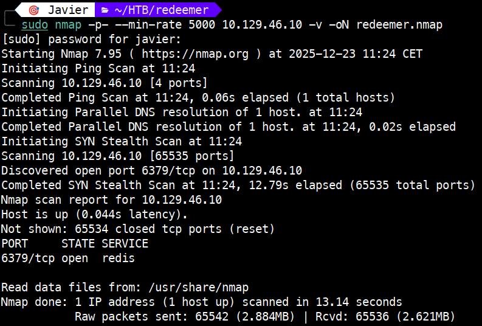 

Puertos encontrados:

6379/tcp → open → redis

## 1.3. Enumeración del servicio 🛠️

Una vez identificado el puerto y el servicio, realizamos un escaneo más detallado:

```bash
sudo nmap -p 6379 -sVC <IP>
```

**NOTA:** `-sVC` : Permite identificar la versión del servicio asociado al puerto (-sV) y ejecutar los scripts por defecto de Nmap (-sC).

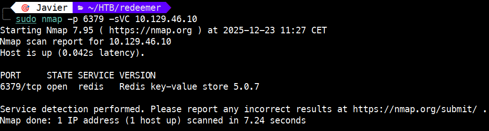

**Interpretación**

Este host parece ser:

- Por el valor del TTL (63 debido al salto introducido por la VPN de HTB), una máquina Linux.

- Tiene alojada una base de datos Redis, concretamente la versión 5.0.7.

# 2. Explotación ⚡

Se buscan CVEs y exploits que puedan afectar a esa versión de la base de datos, sin encontrar nada que permita RCE (Remote Code Execution).

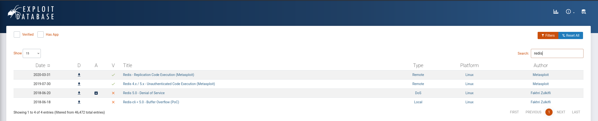

Como no hemos encontrado nada, probamos si tenemos acceso sin credenciales.

```bash
redis-cli -h <IP>
```

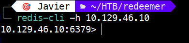

Como vemos, hemos obtenido acceso. A continuación ejecutamos `INFO` para obtener información.

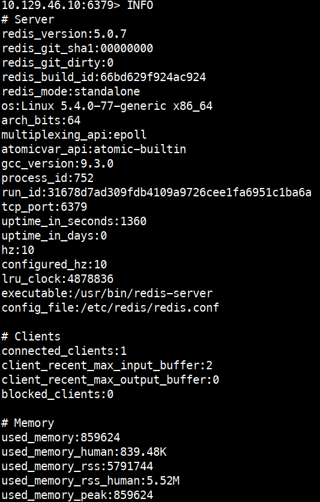

En la salida aparecen muchos datos. Entre ellos, se confirma la versión de Redis (5.0.7), el sistema operativo (Linux 5.4.0-77-generic x86_64) y el puerto (6379).

Destaca el apartado `Keyspace`, que muestra lo siguiente:

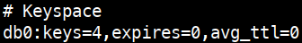

En Redis, un **keyspace** es simplemente un conjunto completo de claves almacenadas dentro de una base de datos. Cada base de datos de Redis tiene su propio keyspace. Por defecto, comienzan en 0.

De la salida anterior, sabemos que solo hay una base de datos con 4 keys.

En Redis, una **key** es simplemente el identificador único que apunta a un valor almacenado en la base de datos.

Si quisiéramos ver solo el apartado de Keyspace, sin ver el resto de información, ejecutamos: `INFO keyspace` como se muestra a continuación.

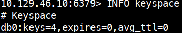

Para seleccionar la base de datos 0 ejecutamos `SELECT 0`.

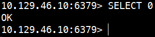

Una vez dentro de la base de datos, para ver las KEYS, ejecutamos `KEYS *`.

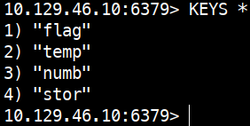

Dentro de esa base de datos tenemos una key que contiene la flag.

# 3. Obtención de la flag 🎉

Para visualizar la key, y por tanto la flag requerida, ejecutamos `GET flag`.

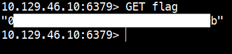

# 4. Técnicas practicadas / Lecciones aprendidas 🧩

- Uso de `ping` para validar la conectividad como primer paso de la enumeración. 

- Una primera enumeración para obtención de los puertos, con `nmap -p- --min-rate`

- Una segunda enumeración, de servicios, con `nmap -sVC` que permite identificar versiones y scripts relevantes.

- Uso de `redis-cli` para interactuar con una base de datos Redis.

- Obtención de la flag tras acceder de forma anónima a la base de datos.

---

# 📝 Cuestionario (Tasks)

### **Task 1**

**Q:** Which TCP port is open on the machine?

**A:** 6379

### **Task 2**

**Q:** Which service is running on the port that is open on the machine?

**A:** redis

### **Task 3**

**Q:** What type of database is Redis? Choose from the following options: (i) In-memory Database, (ii) Traditional Database

**A:** In-memory Database

### **Task 4**

**Q:** Which command-line utility is used to interact with the Redis server? Enter the program name you would enter into the terminal without any arguments.

**A:** redis-cli

### **Task 5**

**Q:** Which flag is used with the Redis command-line utility to specify the hostname?

**A:** -h

### **Task 6**

**Q:**  Once connected to a Redis server, which command is used to obtain the information and statistics about the Redis server

**A:** info

### **Task 7**

**Q:** What is the version of the Redis server being used on the target machine?

**A:** 5.0.7

### **Task 8**

**Q:** Which command is used to select the desired database in Redis?

**A:** select

### **Task 9**

**Q:** How many keys are present inside the database with index 0?

**A:** 4

### **Task 10**

**Q:** Which command is used to obtain all the keys in a database?

**A:** keys *
