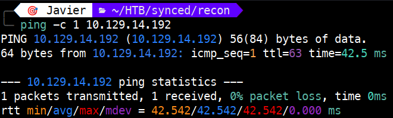
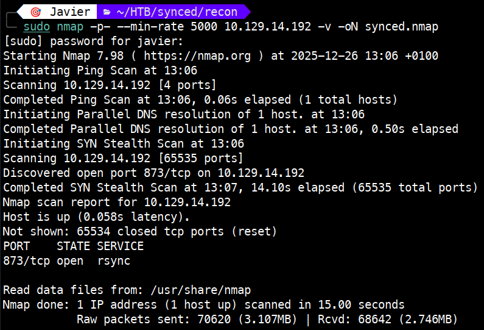
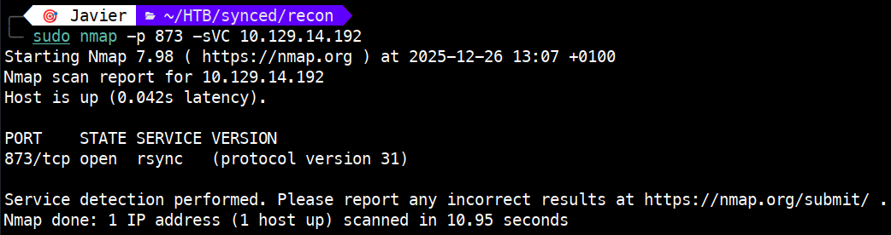
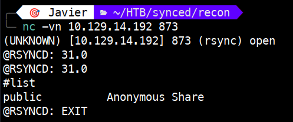
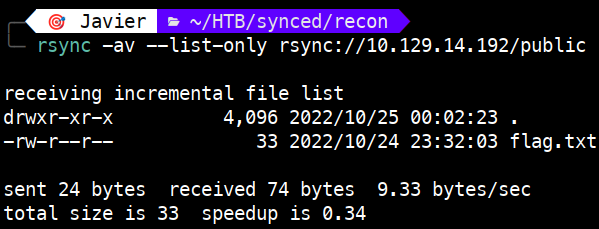
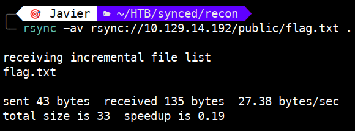
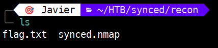
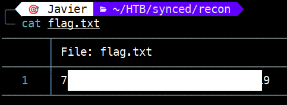

# Synced – Tier 0

Write-up de la máquina **Synced** perteneciente a la ruta *Starting Point* de Hack The Box.


---

# 1. Enumeración 🔍

## 1.1. Comprobación de conectividad 🌐

```bash
ping -c 1 <IP>
```

 

Vemos que tenemos conectividad con la máquina y, además, el TTL nos da una pista del sistema operativo que hay detrás:

- TTL 64 → Linux (TTL 63 si hay un salto intermedio)
   
- TTL 128 → Windows (TTL 127 si hay un salto intermedio)

## 1.2. Descubrimiento de puertos 📡

```bash
sudo nmap -p- --min-rate 5000 <IP> -v
```

 

Puertos encontrados:

873/tcp → open → rsync

**¿Qué es rsync?**

- **Definición**: Es una herramienta y protocolo de red para la sincronización y transferencia eficiente de archivos entre dos sistemas (local-remoto o remoto-remoto).

- **Ventaja**: Utiliza un algoritmo de transferencia diferencial; en lugar de copiar el archivo entero, solo envía las partes que han cambiado, optimizando el ancho de banda.

- **Puerto**: El 873 TCP es el puerto por defecto cuando rsync funciona como un "demonio" (un servicio en escucha activa).

- **Seguridad**: Por defecto, el tráfico en el puerto 873 no va cifrado, lo que lo hace vulnerable a la interceptación de datos si no se tuneliza a través de protocolos seguros como SSH.

## 1.3. Enumeración del servicio 🛠️

Una vez identificados los puertos y servicios, realizamos un escaneo más detallado:

```bash
sudo nmap -p 873 -sVC <IP>
```

**NOTA:** `-sVC`: Permite identificar la versión del servicio asociado al puerto (-sV) y ejecutar los scripts por defecto de Nmap (-sC).



En el apartado **VERSION** de la enumeración, observamos que el servicio utiliza el `protocol version 31`. Esto confirma que el demonio rsync está activo y listo para aceptar conexiones. 

Al tratarse de un servicio que permite la sincronización de archivos, el siguiente paso será intentar listar los "módulos" compartidos para ver si el acceso anónimo está habilitado.

# 2. Explotación ⚡

Para validar la capacidad de interacción con el servicio, realizamos una conexión manual mediante netcat, ejecutando: `nc -vn <IP> 873`.

**NOTA**: -v=verbose, n=no DNS.

Después ejecutamos el comando `#list`, obteniendo la existencia de un módulo compartido llamado `public`, descrito como **Anonymous Share**.

Esta información es clave, ya que confirma que el servidor rsync permite listar contenidos de forma anónima, lo que nos da nuestro próximo objetivo de ataque.

 

Tras confirmar la existencia del módulo public, utilizamos la herramienta `rsync` para listar su contenido de forma remota sin proporcionar ninguna contraseña:

```bash
rsync -av --list-only rsync://<IP>/public
```

**NOTA**:

- -a (archive): Preserva atributos como permisos y fechas, funcionando de forma recursiva.

- -v (verbose): Proporciona detalles visibles sobre el progreso de la tarea.

- --list-only: Permite ver el índice de archivos sin descargarlos.


 

Como se aprecia en la captura, el módulo contiene un archivo `flag.txt`. Debido al permiso de lectura para todos los usuarios (-rw-r--r--), podemos descargarlo para obtener la flag.


# 3. Obtención de la flag 🎉

Para descargar el fichero en nuestro directorio actual, debemos ejecutar:

```bash
rsync -av rsync://<IP>/public/flag.txt .
```



Tras verificar la descarga con un simple ls, procedemos a visualizar el contenido del archivo con cat para obtener la flag requerida.





# 4. Técnicas practicadas / Lecciones aprendidas 🧩

- Uso de `ping` para validar la conectividad como primer paso de la enumeración. El valor del TTL también nos orienta sobre el sistema operativo remoto.

- Una primera enumeración para la obtención de los puertos, con `nmap -p- --min-rate`.

- Una segunda enumeración de servicios, con `nmap -sVC` que permite identificar versiones y scripts relevantes.

- Uso de `netcat` **(nc)** para conectar directamente al puerto 873. Esta técnica permitió validar la respuesta del servicio en tiempo real e interaccionar con el demonio rsync de forma manual para listar sus módulos compartidos.

- Identificación de un fallo de **Control de Acceso (Broken Access Control)** en el demonio rsync, permitiendo la enumeración y descarga de archivos de forma anónima.

- El servicio rsync operando de forma nativa (puerto 873) no cifra la información. Como lección aprendida, este tráfico siempre debe tunelizarse a través de **SSH** para garantizar la confidencialidad.

---

# 📝 Cuestionario (Tasks)

### **Task 1**

**Q:** What is the default port for rsync?

**A:** 873

### **Task 2**

**Q:** How many TCP ports are open on the remote host?

**A:** 1

### **Task 3**

**Q:** What is the protocol version used by rsync on the remote machine?

**A:** 31

### **Task 4**

**Q:**  What is the most common command name on Linux to interact with rsync?

**A:** rsync

### **Task 5**

**Q:** What credentials do you have to pass to rsync in order to use anonymous authentication? anonymous:anonymous, anonymous, None, rsync:rsync 

**A:** None

### **Task 6**

**Q:**  What is the option to only list shares and files on rsync? (No need to include the leading -- characters)

**A:** list-only