# Bike – Tier 1

Write-up de la máquina **Bike** perteneciente a la ruta *Starting Point* de Hack The Box.

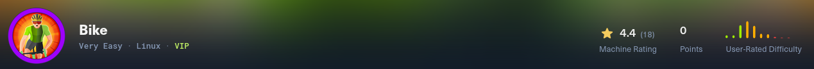 

# 1. Enumeración 🔍

## 1.1. Comprobación de conectividad 🌐

```bash
ping -c 1 <IP>
```
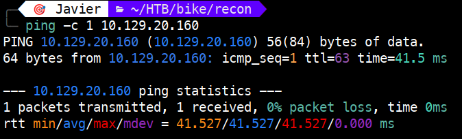 

El **TTL de 63** nos indica que estamos ante una máquina **Linux**.

## 1.2. Descubrimiento de puertos 📡

Realizamos un escaneo rápido para identificar puertos abiertos en todo el rango:

```bash
sudo nmap -p- --min-rate 5000 <IP> -v
```

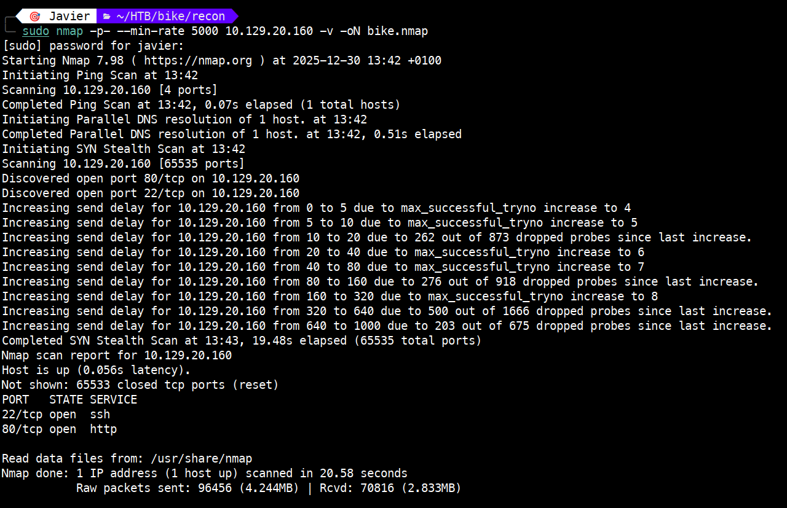 

Puertos encontrados:

- **22/tcp** → open → ssh

- **80/tcp** → open → http

## 1.3. Enumeración de servicios 🛠️

Lanzamos un escaneo detallado sobre los puertos detectados para identificar versiones y tecnologías:

```bash
sudo nmap -p 22,80 -sVC <IP>
```


Hallazgos clave:

- El puerto 80 ejecuta un servidor web basado en **Node.js** con el framework **Express**.


# 2. Explotación ⚡

## 2.1. Análisis del vector de ataque 🕵️

Abrimos la web y lo primero vamos a usar **Wappalyzer** para identificar las tecnologías del servidor y confirmar si coinciden con la información obtenida en el escaneo de puertos previo.

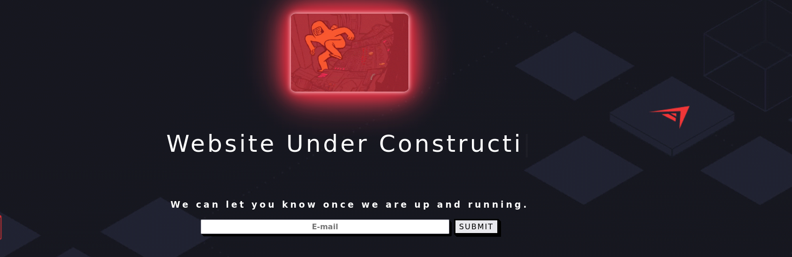 

 

Posteriormente, exploramos el campo e-mail. Para comprobar cómo procesa el backend las entradas de usuario, introducimos una expresión de prueba `{{7*7}}`; al hacerlo, la aplicación devuelve un error detallado en lugar de renderizar el texto.

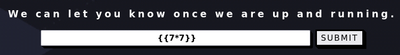 

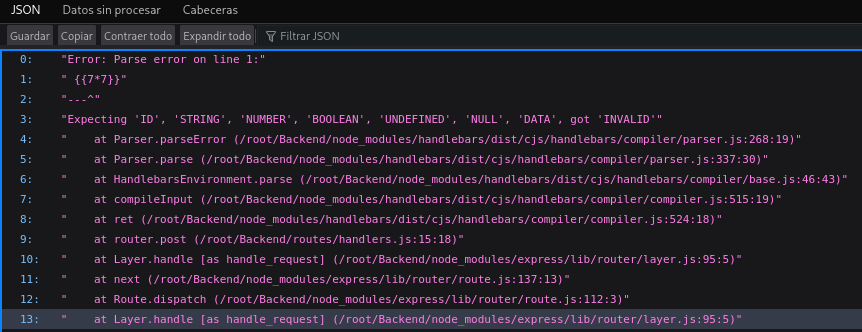 

El error revela que el servidor utiliza el motor de plantillas **Handlebars**. Este comportamiento confirma una vulnerabilidad de **Server-Side Template Injection (SSTI)**. Además, el mensaje de error filtra rutas internas como `/root/Backend/node_modules/handlebars/...`.

## 2.2. Interceptación y RCE mediante Burp Suite 🚀

Para explotar el SSTI, interceptamos la petición con **Burp Suite** y la enviamos al **Repeater**. 

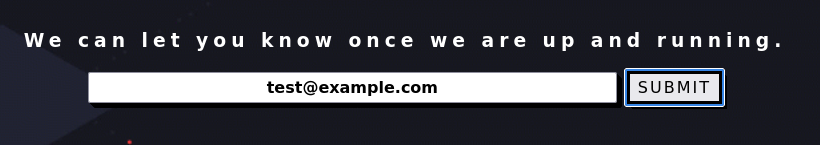

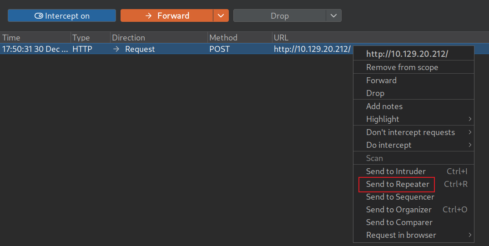

Al enviar la petición, el servidor devuelve un `ReferenceError: require is not defined`, lo que confirma que el motor Handlebars está protegido por un sandbox.

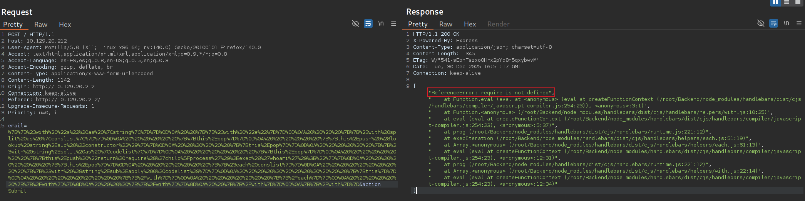 

Una vez identificada la vulnerabilidad, procedemos a la fase de explotación mediante un payload diseñado para evadir el sandbox. Para ello hacemos uso de la función `return process.mainModule.require`. A esta función le vamos a pasar el comando `whoami`. 

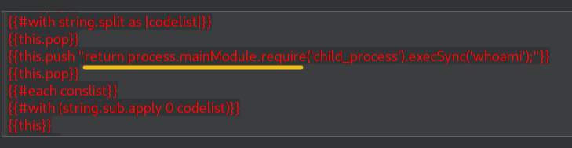

Es fundamental aplicar **URL Encode** al payload para evitar errores en la transmisión. Como vemos en la imagen se ejecuta el `whoami` indicando que somos el usuario root.

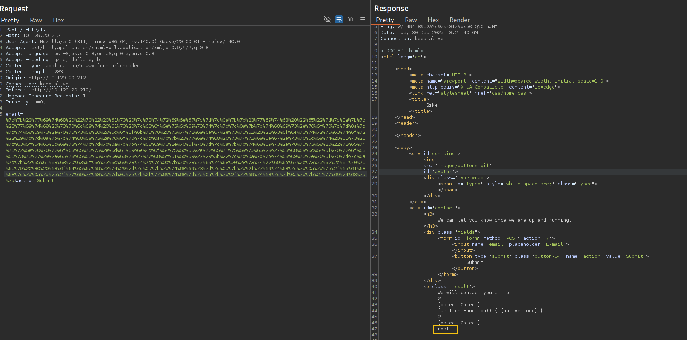 

Si ahora ejecutamos la función anterior con `ls -al /root` listaremos el contenido del directorio root.

  

Como vemos en la salida de la petición, tenemos el archivo `flag.txt` que contiene nuestra flag.

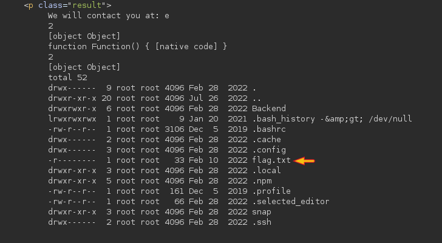  

# 3. Obtención de la flag 🎉

## 3.1. Lectura del archivo flag.txt 🚩

Finalmente, utilizamos el comando `cat` para visualizar el contenido del archivo y completar la máquina.

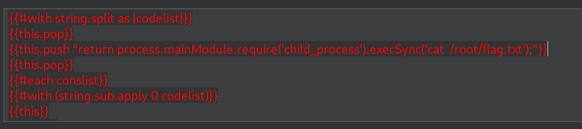

 

# 4. Técnicas practicadas / Lecciones aprendidas 🧩

- **Extracción de información mediante errores**: Usar los mensajes de error del servidor para identificar el software que utiliza la web (en este caso, **Handlebars**).

- **Manipulación de datos con Burp Suite**: Usar la herramienta Burp Suite para la intercepción y modificación de peticiones. Importante codificar los datos (**URL Encode**) para que el servidor los procese correctamente sin errores de sintaxis.

- **Evasión de Sandbox (Saltar protecciones)**: Los motores de plantillas suelen tener una "zona segura" (**sandbox**) que bloquea comandos peligrosos. El uso de un payload más avanzado permite saltar esa protección y acceder a las funciones del sistema.

- **Ejecución Remota de Comandos (RCE)**: Al evadir el sandbox, es posible enviar órdenes directas al sistema operativo (como `whoami` o `cat`) para movernos por las carpetas y leer archivos que deberían ser privados.

---

# 📝 Cuestionario (Tasks)

### **Task 1**

**Q:** What TCP ports does nmap identify as open? Answer with a list of ports seperated by commas with no spaces, from low to high.

**A:** 22,80

### **Task 2**

**Q:** What software is running the service listening on the http/web port identified in the first question?

**A:** Node.js

### **Task 3**

**Q:** What is the name of the Web Framework according to Wappalyzer?

**A:** Express

### **Task 4**

**Q:** What is the name of the vulnerability we test for by submitting {{7*7}}?

**A:** Server Side Template Injection

### **Task 5**

**Q:** What is the templating engine being used within Node.JS?

**A:** Handlebars

### **Task 6**

**Q:** What is the name of the BurpSuite tab used to encode text?

**A:** Decoder

### **Task 7**

**Q:** In order to send special characters in our payload in an HTTP request, we'll encode the payload. What type of encoding do we use?

**A:** URL

### **Task 8**

**Q:** When we use a payload from HackTricks to try to run system commands, we get an error back. What is "not defined" in the response error?

**A:** require

### **Task 9**

**Q:** What variable is the name of the top-level scope in Node.JS?

**A:** global

### **Task 10**

**Q:** By exploiting this vulnerability, we get command execution as the user that the webserver is running as. What is the name of that user?

**A:** root