# Funnel – Tier 1

Write-up de la máquina **Funnel** perteneciente a la ruta *Starting Point* de Hack The Box.

 

# 1. Enumeración 🔍

## 1.1. Comprobación de conectividad 🌐

```bash
ping -c 1 <IP>
```
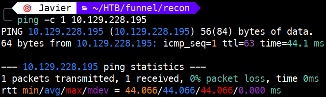 

El **TTL de 63** nos indica que estamos ante una máquina **Linux** (con un salto intermedio).

## 1.2. Descubrimiento de puertos 📡

Realizamos un escaneo rápido para identificar puertos abiertos en todo el rango:

```bash
sudo nmap -p- --min-rate 5000 <IP> -v
```

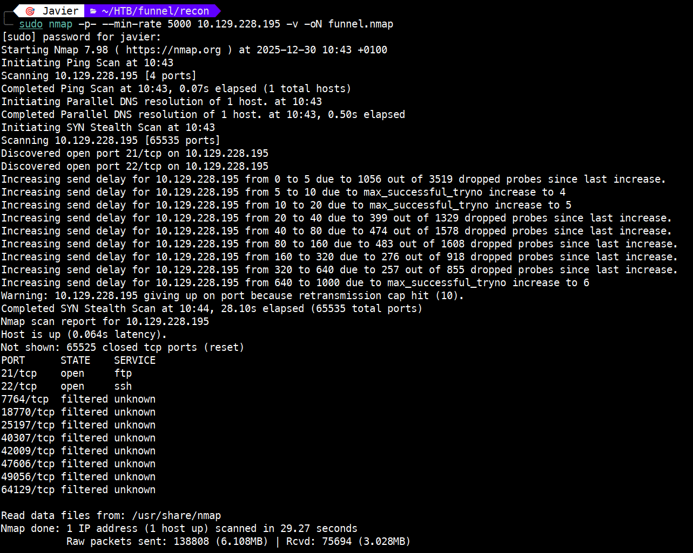 

Puertos encontrados:

- **21/tcp** → open → ftp

- **22/tcp** → open → ssh

Además, el escaneo reporta varios puertos en estado `filtered`, lo que sugiere que podrían existir servicios protegidos por un firewall.

## 1.3. Enumeración de servicios 🛠️

Lanzamos un escaneo detallado sobre los puertos detectados:

```bash
sudo nmap -p 21,22 -sVC <IP>
```

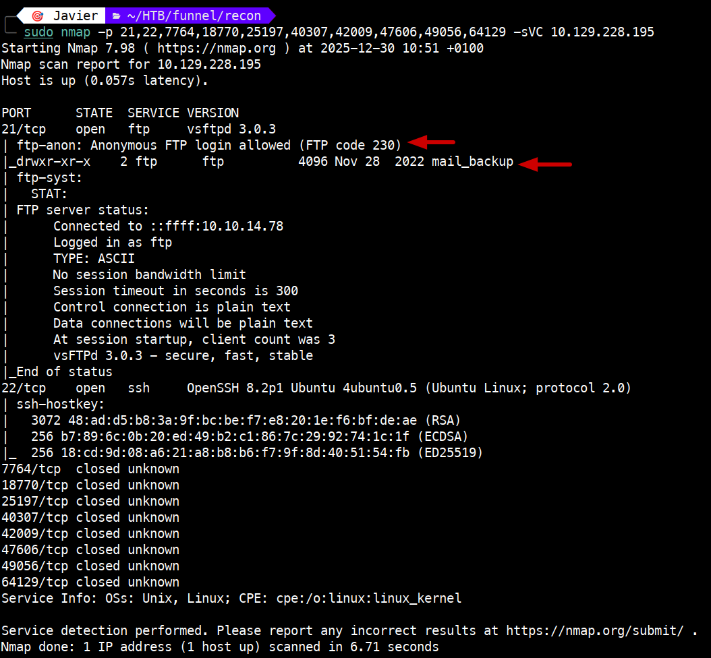

Hallazgos clave:

- El servicio FTP (**vsFTPd 3.0.3**) permite el **login anónimo**.

- Se observa un directorio llamado `mail_backup` en el servidor FTP.

# 2. Explotación ⚡

## 2.1. Intrusión vía FTP anónimo 📁

Conectamos al servicio FTP utilizando las credenciales `anonymous:anonymous`:

```bash
ftp <IP>
```
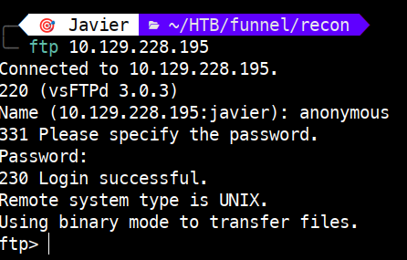

Exploramos el directorio `mail_backup` y descargamos los archivos `password_policy.pdf` y `welcome_28112022`:

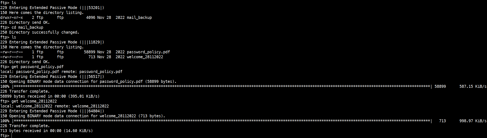

Verificamos que se han descargado los archivos.

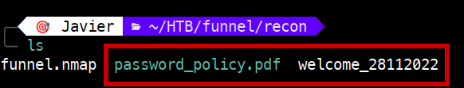 

## 2.2. Análisis de archivos y obtención de credenciales 🕵️

Al abrir el PDF `password_policy.pdf`, encontramos una contraseña por defecto para nuevos usuarios: `funnel123#!#`.

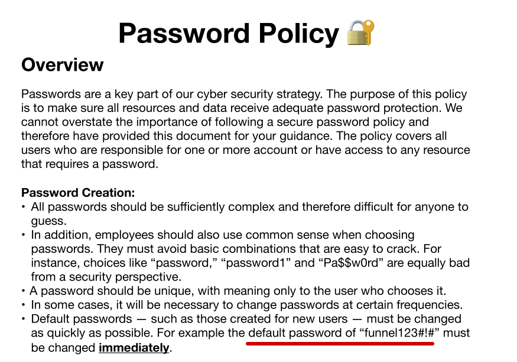 

Después, al revisar el correo de bienvenida `welcome_28112022`, identificamos a los usuarios del sistema (christine, albert, andreas, etc.).

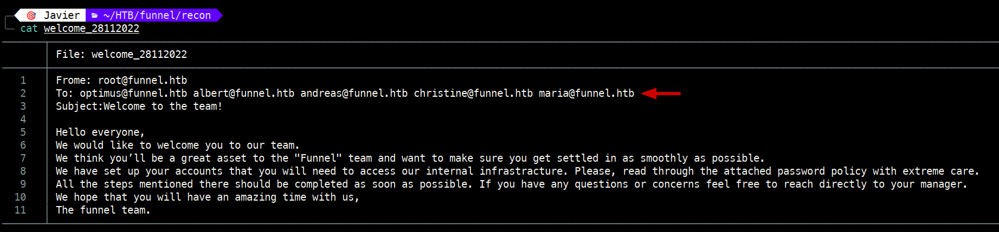


## 2.3. Acceso mediante SSH y Enumeración Interna 🔑

Logramos acceso exitoso mediante SSH con la usuaria **christine**:

```bash
ssh christine@<IP>
```
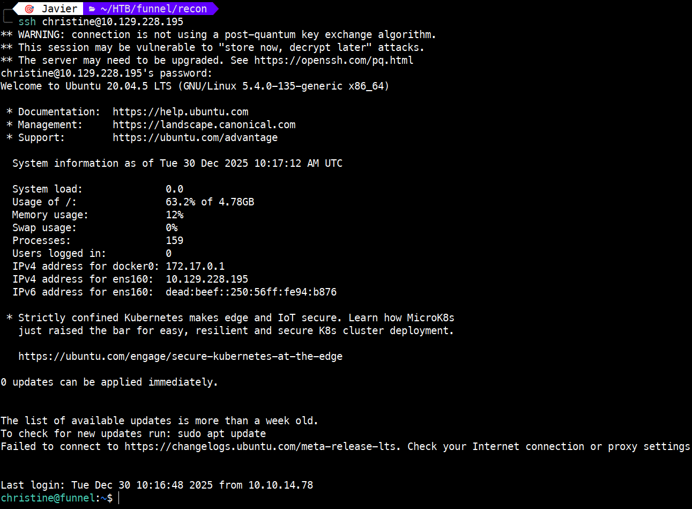

Verificamos que el usuario es christine (`id`), la ruta en la que estamos (`pwd`) y el contenido del directorio, por si hubiera algo de interés. 

 

A continuación, listamos los procesos en ejecución para identificar servicios activos. Mediante `ps -aux` detectamos que el proceso de PostgreSQL está en ejecución, lo que nos induce a pensar que el puerto 5432 podría estar activo localmente.

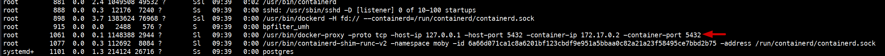 

Detectamos que el puerto **5432 (PostgreSQL)** está activo en localhost, pero no era accesible externamente durante nuestro escaneo inicial.

## 2.4. Local Port Forwarding (SSH Tunneling) 🚀

Para interactuar con la base de datos desde nuestra máquina atacante, creamos un **túnel SSH** redirigiendo el puerto remoto al nuestro local:

```bash
ssh -L 5432:127.0.0.1:5432 christine@<IP>
```

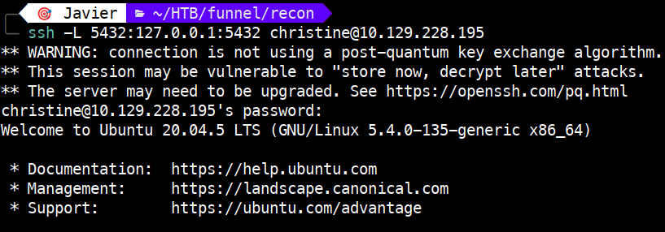 

# 3. Obtención de la flag 🎉

## 3.1. Conexión a PostgreSQL 🐘

Con el túnel activo, conectamos a la base de datos utilizando el cliente `psql` y la contraseña encontrada anteriormente (`funnel123#!#`), explotando la reutilización de credenciales:

```bash
psql -h 127.0.0.1 -p 5432 -U christine
```

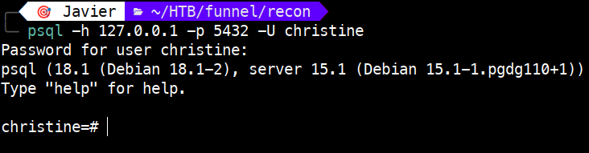 

Una vez dentro, ejecutamos el comando `help` para consultar la ayuda general.

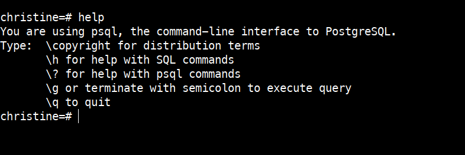 

Asimismo, para ver los comandos de psql, ejecutaremos `\?`.

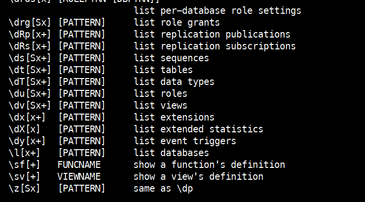 

Finalmente, ejecutaremos `\l` para ver las bases de datos.

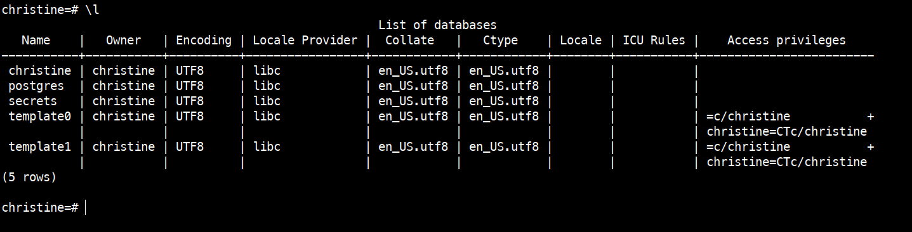 

Llama la atención la base de datos **secrets**. Para conectarnos a ella, ejecutamos `\c secrets` y, seguidamente, listamos las tablas con `\dt`.

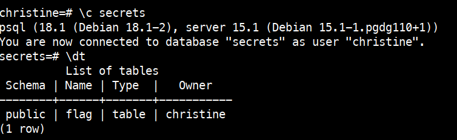 

Identificamos una tabla llamada `flag` y consultamos su contenido ejecutando `SELECT * FROM flag;`, lo que nos permite obtener la flag necesaria para completar la máquina.

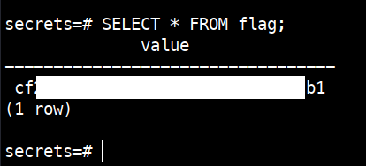 


# 4. Técnicas practicadas / Lecciones aprendidas 🧩

- **Explotación de servicios mal configurados**: Acceso FTP anónimo.

- **Fuga de información en documentos**: Análisis de archivos PDF y correos para la obtención de credenciales y nombres de usuario.

- **Password Reuse**: Reutilizar la misma contraseña para el sistema operativo y servicios de bases de datos.

- **Enumeración de servicios internos**: Importancia de realizar un post-reconocimiento (post-exploitation recon) para descubrir servicios no expuestos a la red externa.

- **SSH Local Port Forwarding**: Uso de túneles para evadir firewalls y acceder a servicios que solo escuchan en interfaces locales (127.0.0.1).

---

# 📝 Cuestionario (Tasks)

### **Task 1**

**Q:** How many TCP ports are open?

**A:** 2

### **Task 2**

**Q:** What is the name of the directory that is available on the FTP server?

**A:** mail_backup

### **Task 3**

**Q:** What is the default account password that every new member on the "Funnel" team should change as soon as possible?

**A:** funnel123#!#

### **Task 4**

**Q:** Which user has not changed their default password yet?

**A:** christine

### **Task 5**

**Q:** Which service is running on TCP port 5432 and listens only on localhost?

**A:** postgresql

### **Task 6**

**Q:** Since you can't access the previously mentioned service from the local machine, you will have to create a tunnel and connect to it from your machine. What is the correct type of tunneling to use? remote port forwarding or local port forwarding?

**A:** local port forwarding

### **Task 7**

**Q:** What is the name of the database that holds the flag?

**A:** secrets

### **Task 8**

**Q:** Could you use a dynamic tunnel instead of local port forwarding? Yes or No.

**A:** Yes

