# Ignition – Tier 1

Write-up de la máquina **Ignition** perteneciente a la ruta *Starting Point* de Hack The Box.

 

# 1. Enumeración 🔍

## 1.1. Comprobación de conectividad 🌐

```bash
ping -c 1 <IP>
```
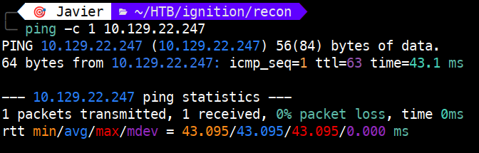 

El **TTL de 63** nos indica que estamos ante una máquina **Linux** (con un salto intermedio).

## 1.2. Descubrimiento de puertos 📡

Realizamos un escaneo rápido para identificar puertos abiertos en todo el rango:

```bash
sudo nmap -p- --min-rate 5000 <IP> -v
```

 

Puertos encontrados:

- **80/tcp** → open → http

## 1.3. Enumeración de servicios 🛠️

Lanzamos un escaneo detallado sobre los puertos detectados:

```bash
sudo nmap -p 80 -sVC <IP>
```

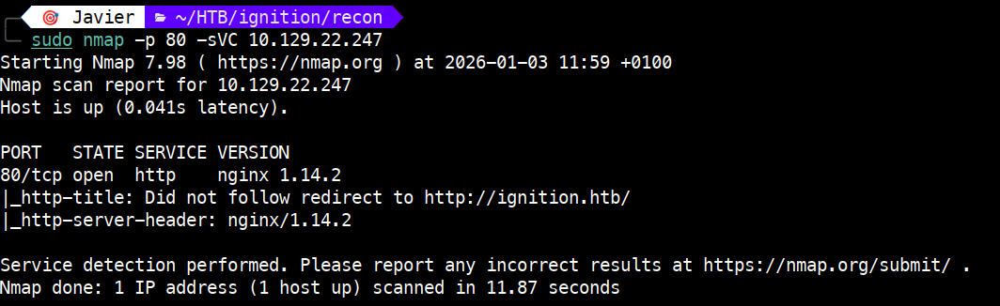

Hallazgos clave:

- El servicio `http` se identifica como `nginx 1.14.2`.

- En `http-title` vemos que el servidor intenta redirigir el tráfico a http://ignition.htb/. Eso nos da una pista, necesitamos resolver el dominio de forma local.


# 2. Explotación ⚡

## 2.1. Análisis del vector 🔍

Mediante `curl` confirmamos que el servidor responde con un código `302 Found`, redirigiendo a http://ignition.htb/.

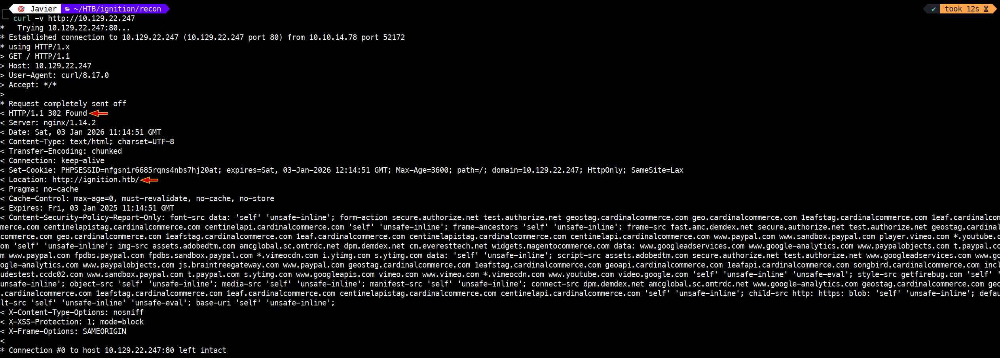

Para que nuestro sistema pueda resolver este dominio, lo añadimos al archivo `/etc/hosts`:

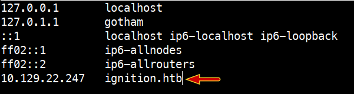

Verificamos que el dominio resuelve correctamente hacia la IP del objetivo:

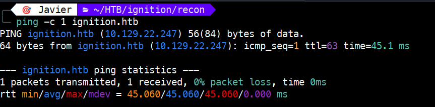

Con el dominio operativo, accedemos a la web, la cual tiene el siguiente aspecto.

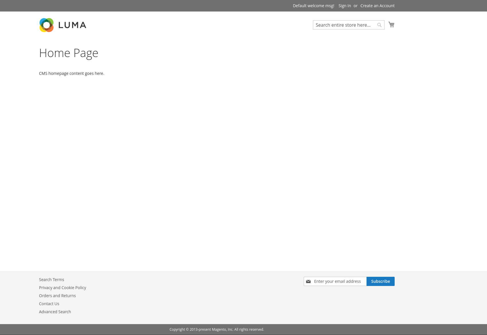

A continuación,  utilizamos **Wappalyzer** para realizar un análisis de las tecnologías empleadas. Identificamos que el sitio utiliza el CMS Magento 2, corriendo sobre PHP y MySQL.

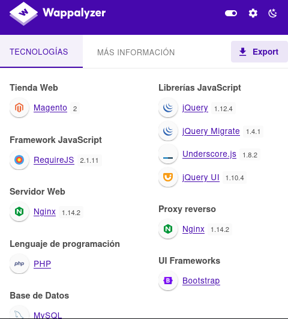

Después vamos a usar **Feroxbuster** para descubrir rutas de administración o  directorios ocultos.

```bash
feroxbuster --url http://ignition.htb
```

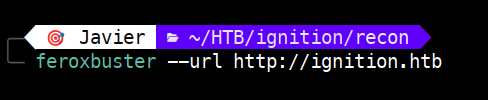

Podemos identificar una ruta `/admin`.

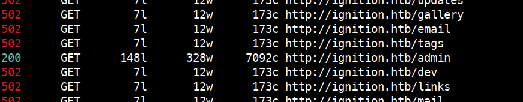

## 2.2. Ejecución del ataque ⚡

Al navegar a http://ignition.htb/admin, nos encontramos con el panel de inicio de sesión de Magento.

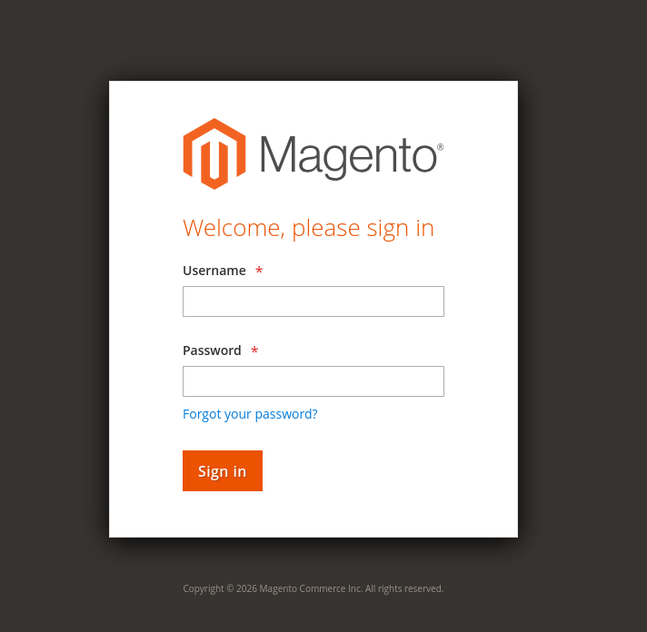

Vamos a introducir como usuario `admin` y contraseña una cualquiera. Con **Burp Suite** vamos a capturar la petición y la vamos a enviar al **Intruder** para hacer un ataque de fuerza bruta.

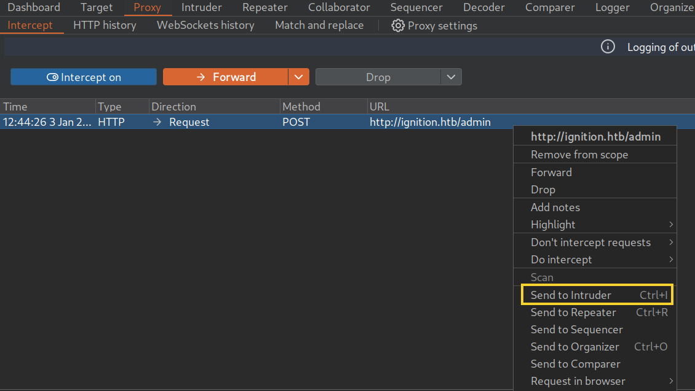

En el **Intruder** vamos a configurar un ataque de tipo `Sniper` sobre el campo de la contraseña y cargamos un diccionario de contraseñas comunes (como `2023-200_most_used_passwords.txt`).

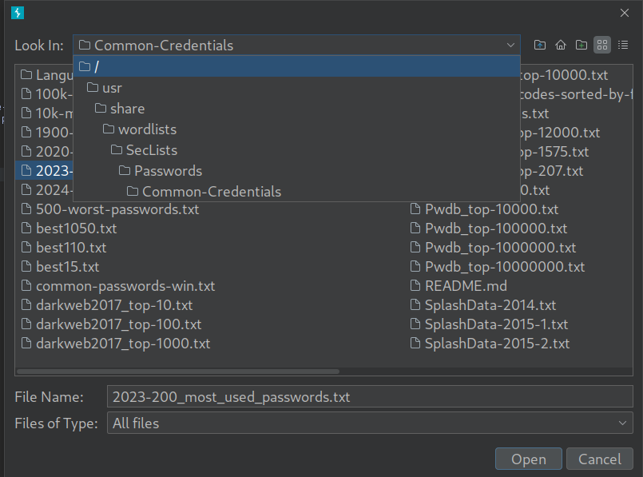

Al procesar el ataque, observamos una respuesta con código `302 (Found)` para el usuario `admin` y la contraseña `qwerty123`. La diferencia en la longitud de la respuesta (3062) respecto a los intentos fallidos confirma que hemos dado con la clave correcta.

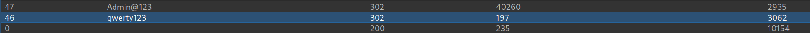


# 3. Obtención de la flag 🎉

Para verificar que es correcto, volvemos al panel de Magento e introducimos las credenciales (`admin` / `qwerty123` ). Como se aprecia en la siguiente imagen, tenemos acceso al portal y podemos ver la flag.

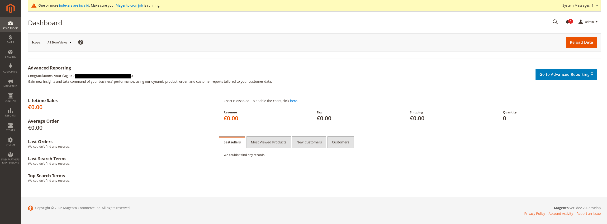

# 4. Técnicas practicadas / Lecciones aprendidas 🧩

- **Uso de Virtual Hosting**: Configurar el archivo `/etc/hosts` es fundamental para una enumeración correcta.

- **Identificar CMS**: El uso de **Wappalyzer** en este reto nos ha permitido identificar Magento 2.

- **Fuzzing Recursivo**: Usar **Feroxbuster** para descubrir directorios ocultos (`/admin`).

- **Uso de Burp Suite**: Con Burp Suite podemos capturar peticiones para enviarlas posteriormente al **Intruder**, donde automatizamos ataques de fuerza bruta.  Debemos interpretar los resultados no solo por el código de estado (302), sino también por la variación en la longitud (Length) de la respuesta HTTP.

- **Higiene de Credenciales**: Este reto demuestra el riesgo crítico de utilizar contraseñas por defecto o extremadamente simples (como qwerty123) en paneles de administración expuestos a internet.

---

# 📝 Cuestionario (Tasks)

### **Task 1**

**Q:** Which service version is found to be running on port 80?

**A:** nginx 1.14.2

### **Task 2**

**Q:** What is the 3-digit HTTP status code returned when you visit http://{machine IP}/?

**A:** 302

### **Task 3**

**Q:** What is the virtual host name the webpage expects to be accessed by?

**A:** ignition.htb

### **Task 4**

**Q:** What is the full path to the file on a Linux computer that holds a local list of domain name to IP address pairs?

**A:** /etc/hosts

### **Task 5**

**Q:** Use a tool to brute force directories on the webserver. What is the full URL to the Magento login page?

**A:** http://ignition.htb/admin

### **Task 6**

**Q:** Look up the password requirements for Magento and also try searching for the most common passwords of 2023. Which password provides access to the admin account?

**A:** qwerty123