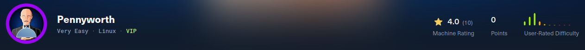
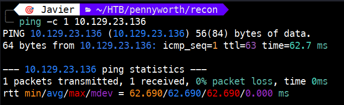
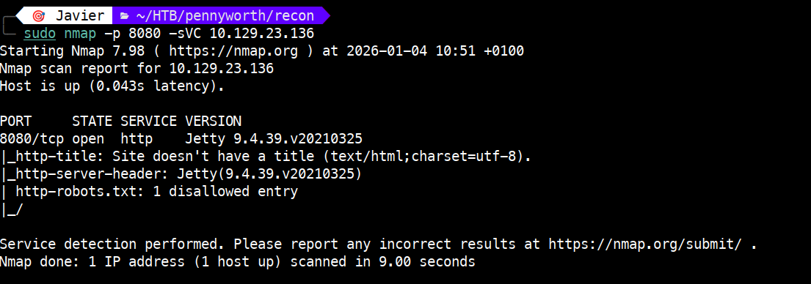
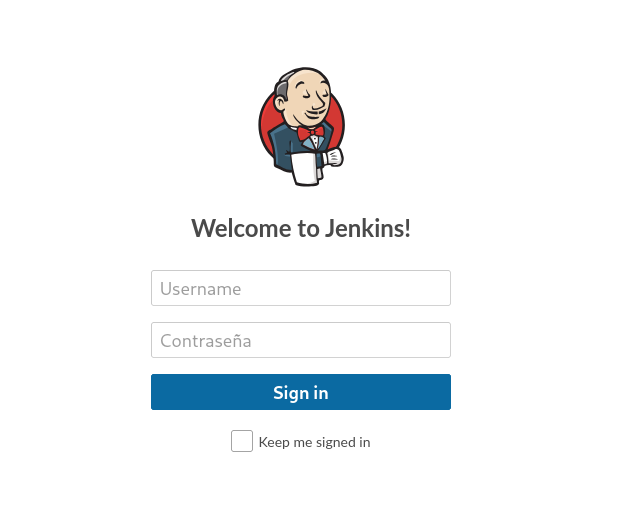
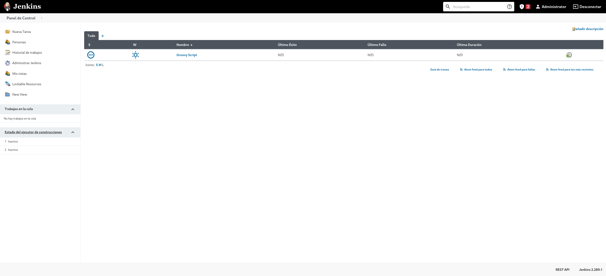
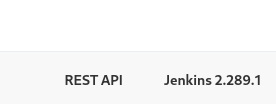
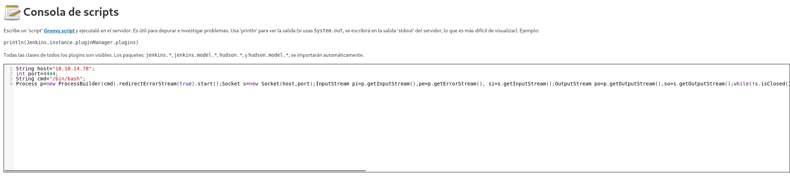
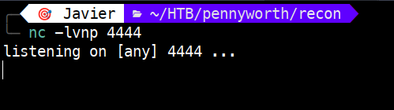
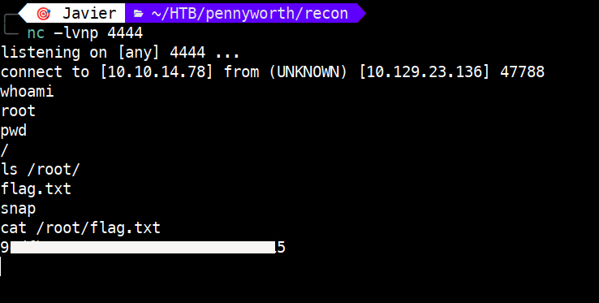

# Pennyworth – Tier 1

Write-up de la máquina **Pennyworth** perteneciente a la ruta *Starting Point* de Hack The Box.



---

# 1. Enumeración 🔍

## 1.1. Comprobación de conectividad 🌐

Iniciamos con un ping para verificar que la máquina responde.

```bash
ping -c 1 <IP>
```

 

El **TTL de 63** nos indica que estamos ante una máquina **Linux** (con un salto intermedio).

## 1.2. Descubrimiento de puertos 📡

Realizamos un escaneo rápido para identificar puertos abiertos:

```bash
sudo nmap -p- --min-rate 5000 <IP> -v
```
 

Puertos encontrados:

- **8080/tcp** → open → http-proxy

## 1.3. Enumeración de servicios 🛠️

Escaneamos el puerto 8080 en profundidad:

```bash
sudo nmap -p 8080 -sVC <IP>
```

 

Hallazgos: 

- Se detecta un servidor **Jetty 9.4.39.v20210325** y un archivo **robots.txt** que bloquea la raíz /.

# 2. Explotación ⚡

## 2.1. Análisis del vector 🔍

Al acceder al puerto **8080**, nos encontramos con un panel de **Jenkins**. Jenkins es una herramienta que permite automatizar tareas de despliegue.

 

Probamos las credenciales por defecto: `root/password`, y conseguimos entrar al dashboard.

 

Abajo a la derecha podemos ver la versión `Jenkins 2.289.1`.

 


## 2.2. Ejecución del ataque ⚡

Hacemos uso de la **Consola de scripts** de Jenkins para ejecutar código Groovy y obtener una Reverse Shell.

- Usamos un [script de Groovy](https://swisskyrepo.github.io/InternalAllTheThings/cheatsheets/shell-reverse-cheatsheet/#groovy) configurado con nuestra IP y puerto.



- Preparamos el escucha: `nc -lvnp 4444`.



# 3. Obtención de la flag 🎉

Tras ejecutar el script, recibimos la conexión. Al comprobar con `whoami`, vemos que somos **root**. Solo queda leer la flag.



# 4. Técnicas practicadas 🧩

- **Identificación de Jenkins**: Reconocimiento de servicios en puertos no estándar (8080).

- **Explotación de credenciales débiles**: Importancia de cambiar los logins por defecto.

- **RCE vía Groovy**: Ejecución remota de comandos mediante scripts Groovy.

---

# 📝 Cuestionario (Tasks)

### **Task 1**

**Q:** What does the acronym CVE stand for?

**A:** Common Vulnerabilities and Exposures

### **Task 2**

**Q:** What do the three letters in CIA, referring to the CIA triad in cybersecurity, stand for?

**A:** confidentiality, integrity, availability

### **Task 3**

**Q:** What is the version of the service running on port 8080?

**A:** Jetty 9.4.39.v20210325

### **Task 4**

**Q:** What version of Jenkins is running on the target?

**A:** 2.289.1

### **Task 5**

**Q:** What type of script is accepted as input on the Jenkins Script Console?

**A:** Groovy

### **Task 6**

**Q:** What would the "String cmd" variable from the Groovy Script snippet be equal to if the Target VM was running Windows?

**A:** cmd.exe

### **Task 7**

**Q:** What is a different command than "ip a" we could use to display our network interfaces' information on Linux?

**A:** ifconfig

### **Task 8**

**Q:** What switch should we use with netcat for it to use UDP transport mode?

**A:** -u

### **Task 9**

**Q:** What is the term used to describe making a target host initiate a connection back to the attacker host?

**A:** reverse shell