# Tactics – Tier 1

Write-up de la máquina **Tactics** perteneciente a la ruta *Starting Point* de Hack The Box.


---

# 1. Enumeración 🔍

## 1.1. Comprobación de conectividad 🌐

Iniciamos con un ping para verificar que la máquina responde.

```bash
ping -c 1 <IP>
```

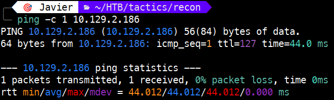 

El **TTL de 127** nos indica que estamos ante una máquina **Windows** (indicando la presencia de un salto intermedio en la red).

## 1.2. Descubrimiento de puertos 📡

Realizamos un escaneo rápido para identificar puertos abiertos:

```bash
sudo nmap -p- --min-rate 5000 <IP> -v
```
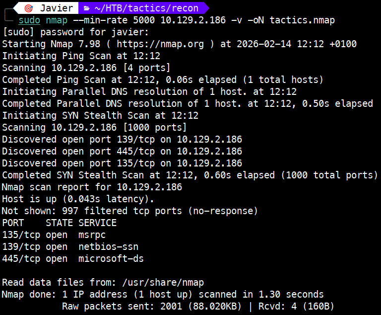 

Puertos encontrados:

- **135/tcp** → open → msrcp

- **139/tcp** → open → netbios-ssn

- **445/tcp** → open → microsoft-ds

## 1.3. Enumeración de servicios 🛠️

Escaneamos los puertos encontrados en profundidad:

```bash
sudo nmap -p 135,139,445 -sVC <IP>
```

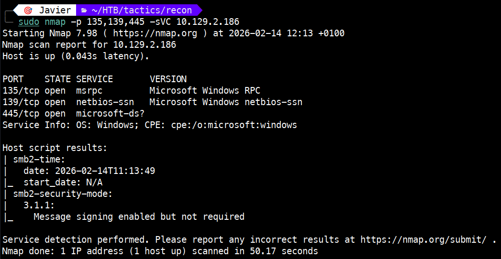 

Hallazgos:

- **SO Identificado**: Confirmamos que es una máquina Windows (deducido por el TTL de 127 y el puerto 135 abierto).

- **Servicio de archivos activo**: El puerto 445 (SMB) está abierto, lo que indica que la máquina permite compartir carpetas.

- **Configuración de seguridad relajada**: Nmap confirma que el "Message Signing" no es obligatorio (Message signing enabled but not required). Esto nos indica que el servidor aceptará conexiones aunque no sean 100% seguras.

# 2. Explotación ⚡

## 2.1. Análisis del vector 🔍

Como tenemos un puerto 445 abierto, vamos a comprobar si podemos ver y acceder a las carpetas compartidas (shares) de la máquina. Para este paso usaremos la herramienta `smbmap` probando primero con el usuario guest.

```bash
smbmap -H <IP> -u 'guest' -p ''
```

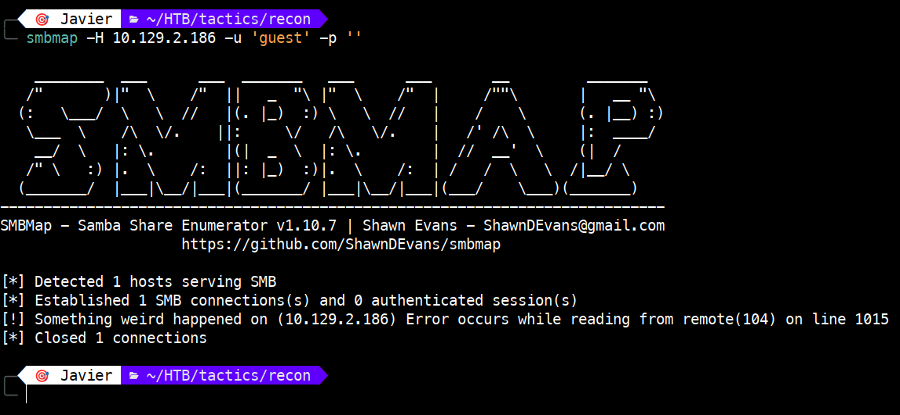 

Tras comprobar que con el usuario `guest` no tenemos acceso, intentaremos la conexión con el usuario `administrator` dejando la contraseña en blanco.

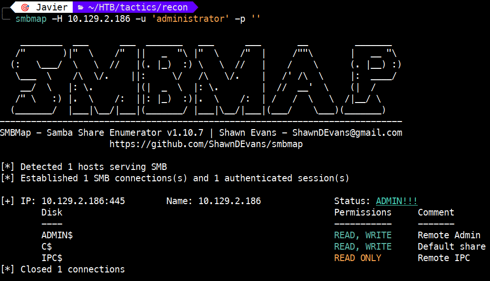 

Al usar el usuario `administrator` sin contraseña, logramos autenticarnos y listar los recursos compartidos (shares). Como se observa en la salida, obtenemos el mensaje `Status: ADMIN!!!`, lo que confirma que esta cuenta tiene privilegios totales sobre el servicio SMB y acceso completo a los archivos.

De los recursos compartidos mostrados, nos centraremos en `C$`. En entornos Windows, este es un recurso administrativo oculto que nos da acceso directo a la unidad raíz **C:**. Al tener permisos de lectura y escritura sobre él, podemos navegar por todas las carpetas del sistema, incluyendo los directorios de usuarios donde suele alojarse la información crítica.

## 2.2. Ejecución del ataque vía smbclient

Para acceder al recurso y navegar por los directorios, usaremos `smbclient` en lugar de `smbmap`, ya que nos permite una interacción más fluida con el sistema de archivos.

```bash
smbclient -U 'administrator' //<IP>/C$
```

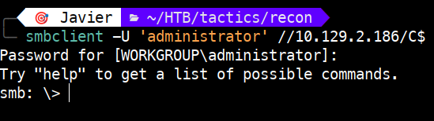 

Una vez dentro del share `C$`, vamos a listar el contenido.

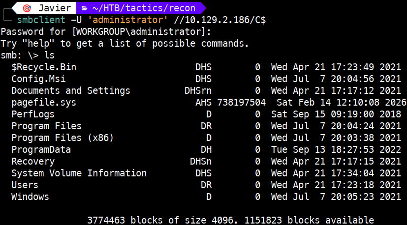 

De los directorios encontrados, accederemos a `Users` con el comando `cd`. Aquí buscamos qué perfiles de usuario existen en la máquina; el directorio `Administrator` es nuestro objetivo principal.

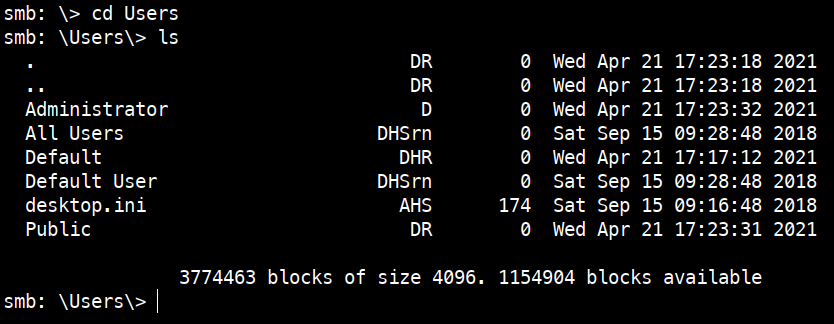 

Una vez dentro del perfil del administrador, listamos el contenido con `ls` para localizar carpetas personales.

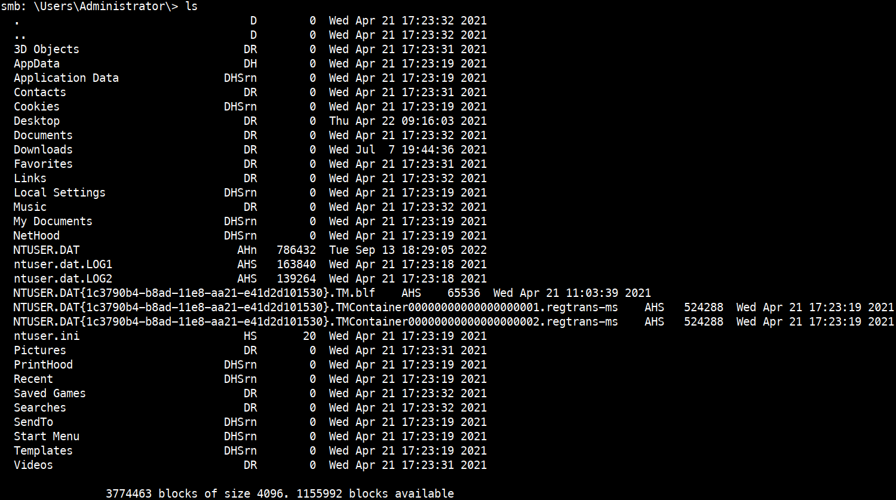 

Es habitual en estos retos, que el fichero de la flag se encuentre en el escritorio (Desktop). Accedemos al directorio y confirmamos la presencia del fichero.

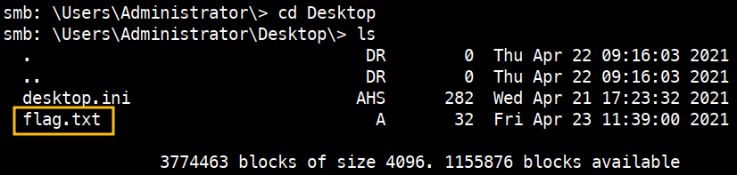 

## 2.3. Ejecución del ataque vía impacket

Como alternativa al uso de `smbclient` usaremos la suite  `Impacket`. Mientras que con `smbclient` podemos ver y descargar archivos, con `impacket` podemos tener control total. 

El uso de `impacket-psexec` no solo nos deja ver carpetas, sino que nos abre una terminal interactiva (shell). Esto nos permite ejecutar comandos directamente en la máquina víctima.

```bash
impacket-psexec administrator@<IP>
```

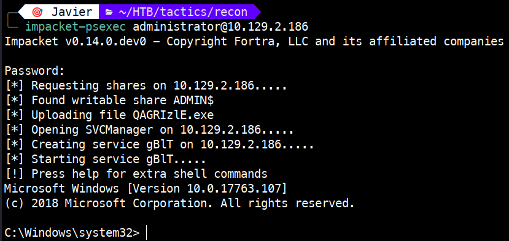 

Una vez dentro, ejecutamos el comando `whoami` para verificar que usuario somos. En este caso, confirmamos que somos `nt authority\system`, el usuario con el máximo nivel de privilegios en el sistema Windows. Con este acceso, tenemos control absoluto sobre la máquina.

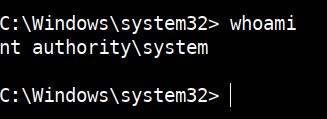 

# 3. Obtención de la flag 🎉

## 3.1 Obtención de la flag vía smbclient

Para obtener la flag, usaremos `get` para descargar el fichero a nuestra máquina atacante.

```bash
get flag.txt
```

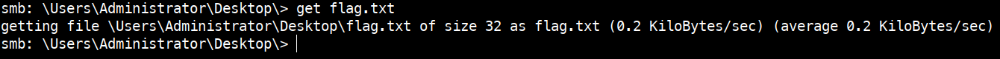 

Ahora, en nuestra máquina atacante, listamos el directorio en el que hemos descargado la flag para confirmar que tenemos el fichero y con el comando `cat` vemos la flag solicitada.

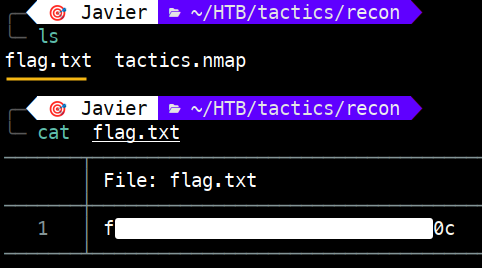 

## 3.2 Obtención de la flag vía impacket

Para conseguir la flag, navegamos al directorio `C:\Users\Administrator\Desktop` haciendo uso del comando `cd`. Después, listamos el contenido con el comando `dir`. Como vemos, al igual que en el punto anterior, tenemos el fichero `flag.txt` que contiene la flag. 

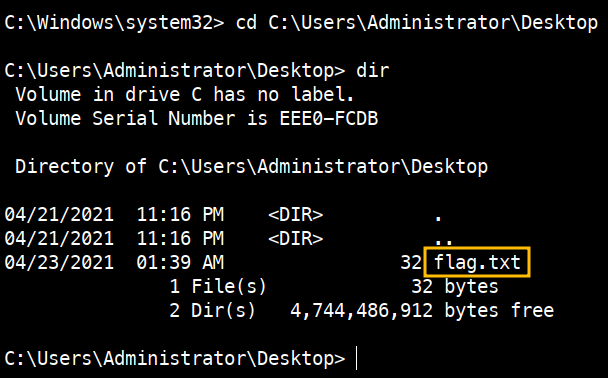 

A diferencia del uso de smbclient, en donde descargamos el fichero, aquí podemos ver el contenido del fichero con el comando `type`.

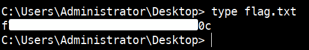 


# 4. Técnicas practicadas / Lecciones aprendidas 🧩

- **Enumeración de servicios SMB**: Uso de `smbmap` para la identificación de recursos compartidos (shares) y niveles de permisos, permitiendo detectar configuraciones inseguras de forma rápida.

- **Gestión de archivos remota**: Uso de `smbclient` para navegar por sistemas de archivos remotos, demostrando la capacidad de exfiltrar información (como la flag) una vez obtenida la autenticación.

- **Explotación de vectores RCE con Impacket**: Implementación de `psexec` para obtener una terminal interactiva (shell) con privilegios de `NT AUTHORITY\SYSTEM` aprovechando sesiones administrativas.

- **Vulnerabilidad de Identidad (Higiene de contraseñas)**: Identificación del riesgo crítico que suponen las cuentas con privilegios elevados (Administrator) que carecen de contraseña o MFA, facilitando el acceso inicial.

- **Diferenciación de herramientas**: Comprensión de cuándo usar herramientas de inspección (`smbclient`) frente a herramientas de ejecución remota de código (`impacket`) según el objetivo del ataque.

---

# 📝 Cuestionario (Tasks)

### **Task 1**

**Q:** Which Nmap switch can we use to enumerate machines when our ping ICMP packets are blocked by the Windows firewall?

**A:** -Pn

### **Task 2**

**Q:** What does the 3-letter acronym SMB stand for?

**A:** Server Message Block

### **Task 3**

**Q:** What port does SMB use to operate at?

**A:** 445

### **Task 4**

**Q:** What command line argument do you give to smbclient to list available shares?

**A:** -L

### **Task 5**

**Q:** What character at the end of a share name indicates it's an administrative share?

**A:** $

### **Task 6**

**Q:** Which Administrative share is accessible on the box that allows users to view the whole file system?

**A:** C$

### **Task 7**

**Q:** What command can we use to download the files we find on the SMB Share?

**A:** get

### **Task 8**

**Q:** Which tool that is part of the Impacket collection can be used to get an interactive shell on the system?

**A:** psexec.py