# Included – Tier 2

Write-up de la máquina **Included** perteneciente a la ruta *Starting Point* de Hack The Box.


---

# 1. Enumeración 🔍

## 1.1. Comprobación de conectividad 🌐

Iniciamos con un ping para verificar que la máquina responde.

```bash
ping -c 1 <IP>
```

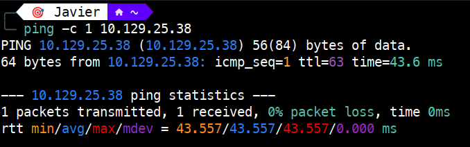 

El **TTL de 63** nos indica que estamos ante una máquina **Linux** (indicando la presencia de un salto intermedio en la red).

## 1.2. Descubrimiento de puertos 📡

Realizamos un escaneo rápido para identificar puertos abiertos:

```bash
sudo nmap -p- --min-rate 5000 <IP> -v
```
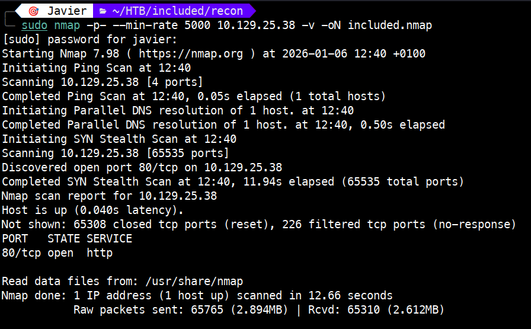 

Puertos encontrados:

- **80/tcp** → open → http

## 1.3. Enumeración de servicios 🛠️

Escaneamos los puertos encontrados en profundidad:

```bash
sudo nmap -p 80 -sVC <IP>
```

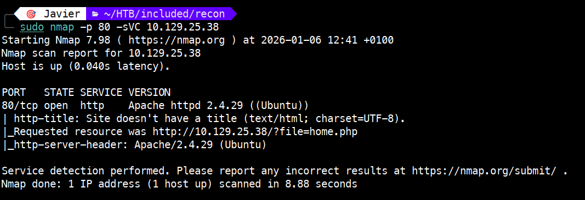 

Hallazgos:

- **SO Identificado**: Confirmamos que es una máquina Linux (Ubuntu). Esto se deduce por la cabecera del servidor Apache y la estructura de las rutas de archivos detectada.

- **Servicio Web Expuesto**: El puerto 80 (HTTP) está abierto, corriendo una versión de `Apache 2.4.29`.

- **Punto de Entrada Potencial**: Nmap ha detectado el uso de parámetros dinámicos en la URL (`file=home.php`). Esto sugiere una configuración que podría permitir un ataque de Local File Inclusion (LFI).

- **Configuración de Redirección**: El script de nmap revela que el recurso solicitado redirige automáticamente a un script de PHP, lo que confirma que el backend está procesando activamente archivos del lado del servidor.

# 2. Explotación ⚡

Una vez realizada la enumeración, procederemos con la fase de explotación. Vamos en primer lugar a abrir la web en nuestro navegador, la cual tiene este aspecto.

 

Usaremos la extensión Wappalazyer para ver la información sobre la tecnología usada en la web. Como vemos en la imagen siguiente, se confirma el uso de Apache y Ubuntu, que ya vimos en la enumeración.

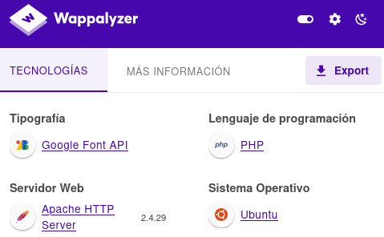 

Ahora procedemos a revisar ficheros o directorios ocultos usando la herramienta `feroxbuster`.

```bash
feroxbuster --url http://<IP>
```

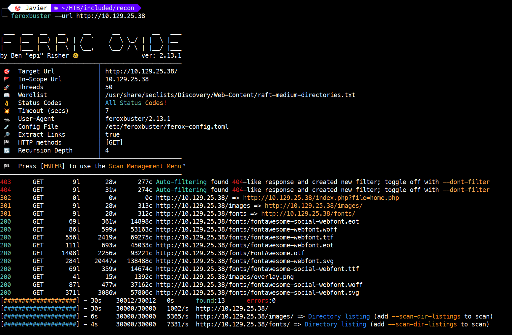 

De la salida anterior, vemos que hay una redirección a `http://<IP>/index.php?file=home.php`. Teniendo en cuenta esto, vamos a ver si logramos un LFI (Local File Inclusion) y ver por ejemplo el fichero `/etc/passwd` del sistema. Para realizar ese paso ejecutaremos en el navegador `http://<IP>/?file=../../../../etc/passwd`

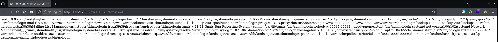 

Hemos obtenido éxito; se pueden ver los usuarios del sistema. Aquí tenemos una mejor vista viendo el código fuente.

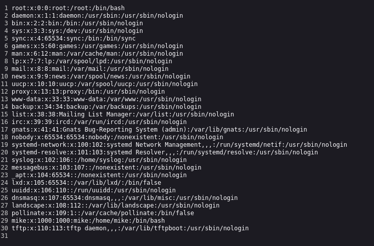 

Llegados a este punto y tras varias vueltas, llegamos a un punto sin salida. Esta máquina tiene truco, mientras que en la mayoría de retos nos centramos en los puertos TCP, en éste debemos enumerar los puertos UDP. Para ello ejecutamos `sudo nmap -sU --top-ports 200 10.129.25.38 -v`, obteniendo el siguiente resultado.

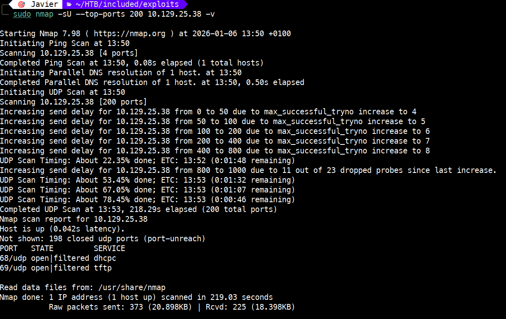 

Ahí tenemos un puerto interesante: `69/UDP - tftp`

> **NOTA**: TFTP son las siglas de Trivial File Transfer Protocol. Es un protocolo de transferencia de archivos, inseguro porque no admite mecanismos de autenticación ni cifrado.

Vamos a conectarnos vía `tftp` ejecutando:

```bash
tftp <IP>
```

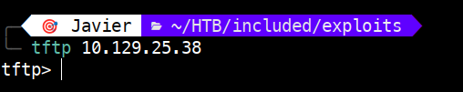 

Una vez tenemos acceso, vamos a ver la ayuda (`--help`) para saber qué comandos tenemos.

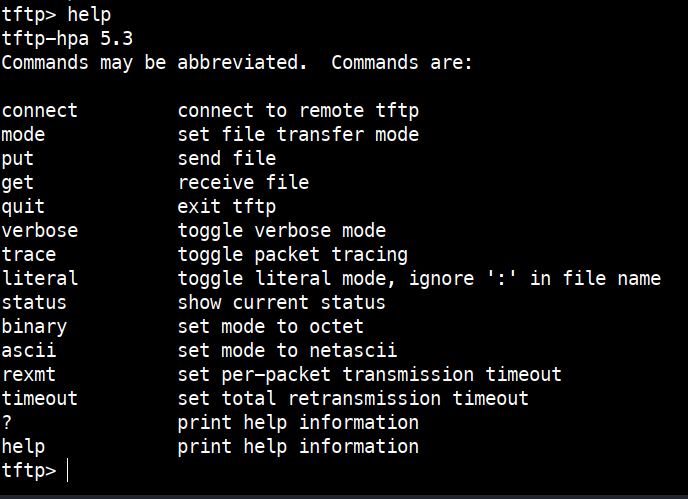 

Como podemos subir ficheros, vamos a crearnos una reverse shell en PHP y subirla. El código de la reverse shell se puede obtener del respositorio de [Pentest Monkey](https://github.com/pentestmonkey/php-reverse-shell/blob/master/php-reverse-shell.php).

En el código debemos modificar `$ip` (IP de nuestra máquina atacante) y `$port` (el puerto de nuestro listener).

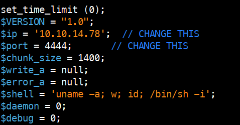 

Para subir nuestro fichero (en mi caso `revshell.php`) ejecutamos:

```bash
tftp> put revshell.php
```
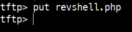 

Ahora debemos levantar nuestro listener:

```bash
nc -lvnp 4444
```

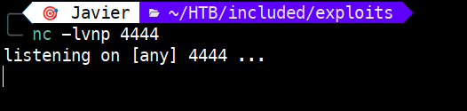 

Después vamos a ejecutar la reverse shell abriendo en nuestro navegador el fichero: `http://<IP>/?file=/var/lib/tftpboot/revshell.php`

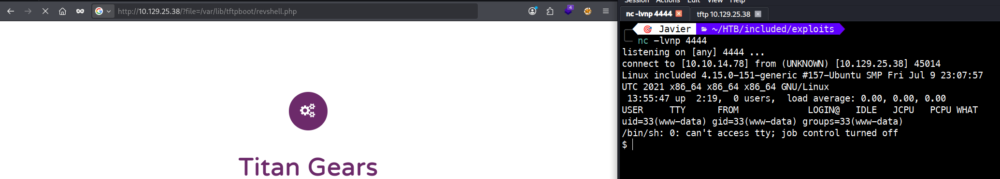 

Como vemos en la anterior captura, estamos dentro de la máquina. 

Para mejorar la shell ejecutamos: `python3 -c 'import pty;pty.spawn("/bin/bash")'`

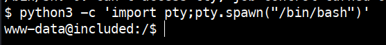 

A continuación vamos a ver en qué ruta estamos (`pwd`). Vemos que estamos en el directorio raíz (`/`), por lo que nos cambiamos (cd) a `/var/www/html$`.

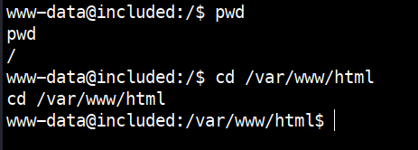 

Ahora listamos el contenido del directorio.

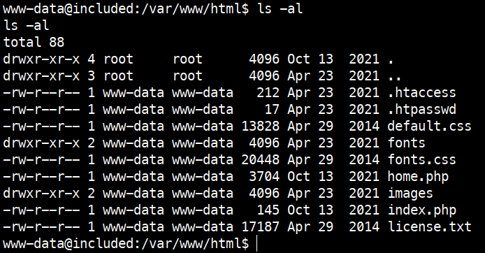

Hay dos ficheros que vamos a explorar, `.htaccess` y `.htpasswd`

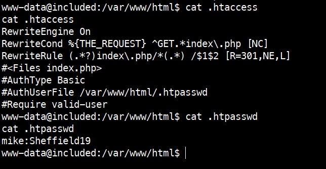

Del segundo, obtenemos unas credenciales (`mike:Sheffield19`) que vamos a utilizar. Vamos a cambiar del usuario `www-data` a `mike` con el comando `su`.

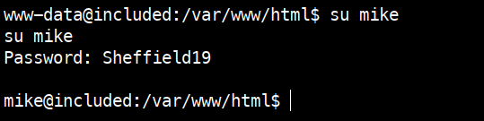

A continuación, nos cambiamos al directorio de mike (`cd /home/mike`) y listamos el contenido (`ls -al`). En éste se encuentra el fichero `user.txt` cuyo contenido veremos en el paso **4.1 Flag usuario**.

# 3. Escalada de privilegios 🧗

Ahora vamos a proceder a escalar del usuario `mike` a `root`. Como primer paso, vamos a verificar los grupos (`groups`) y  la identidad del usuario y sus privilegios mediante el comando `id`.

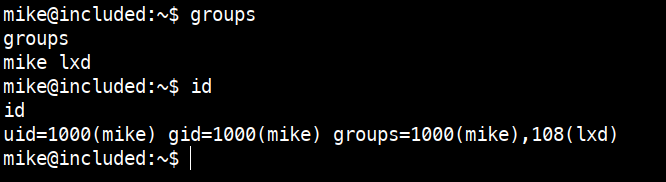

Del resultado anterior, vemos que el usuario `mike` pertenece al grupo **lxd**. En Linux, esto permite a un usuario interactuar con el daemon de contenedores. Un atacante puede crear un contenedor privilegiado y montar la raíz (`/`) del sistema host para obtener acceso total como root.

Para la explotación, necesitamos una imagen ligera. Dado que la máquina víctima tiene restricciones, preparamos el entorno en nuestra máquina de atacante.

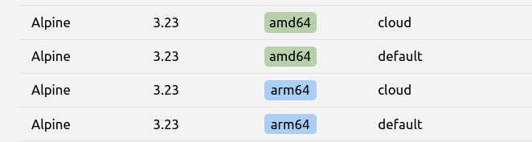

Confirmamos la arquitectura y los detalles de la imagen **Alpine** necesaria. Para que la explotación funcione, debemos descargar y transferir dos archivos esenciales: `lxd.tar.xz` (los metadatos) y `rootfs.squashfs` (el sistema de archivos raíz).

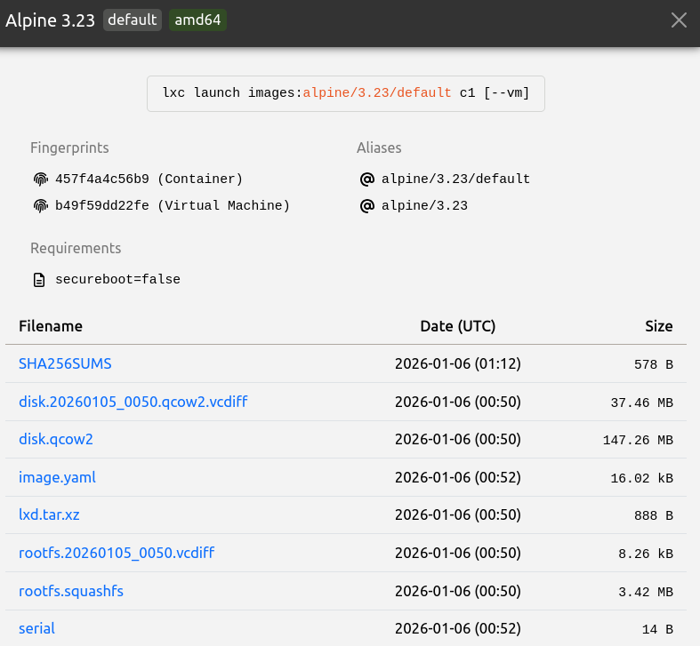

Posteriormente, iniciamos un servidor HTTP temporal con Python para transferir los archivos de la imagen a la víctima.

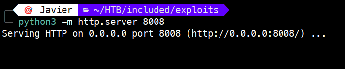


Ahora, desde la sesión de `mike`, descargamos los archivos de la imagen (`lxd.tar.xz` y `rootfs.squashfs`) usando `wget`.

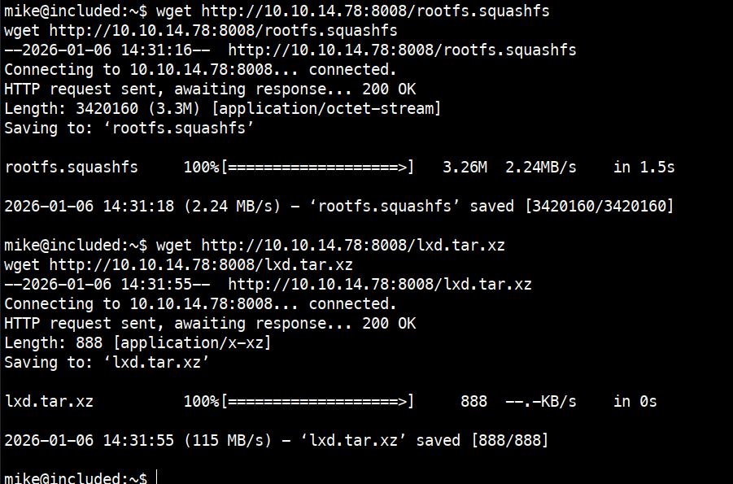

Verificamos que los archivos se encuentran en el directorio de trabajo.

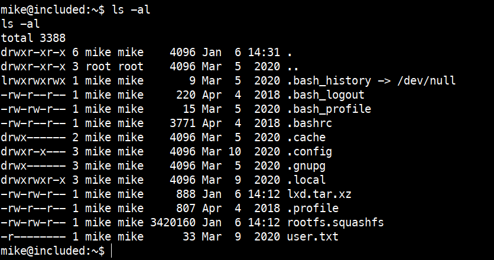

Importamos la imagen descargada a la base de datos de LXC asignándole el alias "alpine".


A continuación, vamos a inicializar el contenedor con el flag `security.privileged=true` y montar el disco del host en el directorio `/mnt/root` del contenedor.

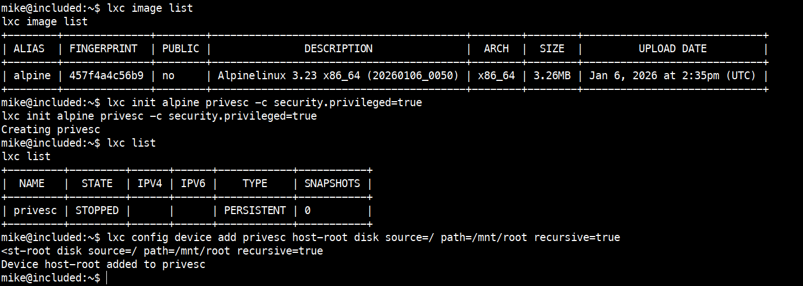

Finalmente, iniciamos el contenedor y ejecutamos una shell. Al estar dentro del contenedor como `root` y tener el sistema de archivos del host montado, podemos acceder a cualquier archivo de la máquina víctima, como por ejemplo la flag de root que vemos en el punto **4.2 Flag root**.

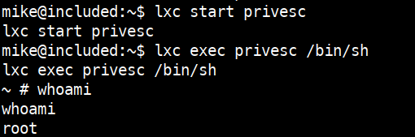

# 4. Obtención de la flag 🎉

## 4.1 Flag usuario

En el punto dos, cuando cambiamos del usuario **www-data** al usuario **Mike**, y obtuvimos acceso a su home, localizamos el fichero `user.txt` que contiene la flag que vemos a continuación.

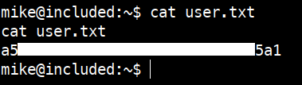

## 4.2 Flag root

Como vimos en la escalada de privilegios, obtuvimos una shell como root. Cambiando al directorio donde tenemos montada la raíz del sistema host (`/mnt/root`) podemos leer el fichero `root.txt`, 

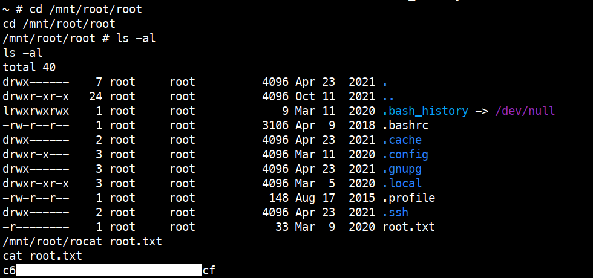

# 5. Técnicas practicadas / Lecciones aprendidas 🧩

- **Enumeración No Convencional (UDP)**: La importancia de no limitarse al escaneo de puertos TCP. El servicio **TFTP (69/UDP)** fue el vector ciego que permitió la intrusión inicial.

- **Encadenamiento de Vulnerabilidades (Vulnerability Chaining)**: Se combinó un LFI (Local File Inclusion) con la capacidad de subida de archivos vía TFTP para transformar una lectura de archivos pasiva en una RCE (Remote Code Execution).

- **Post-Explotación y Enumeración Local**: Localización de credenciales en archivos de configuración ocultos (`.htpasswd`).

- **Explotación de Configuraciones de Contenedores**: Identificación del **grupo LXD** como un vector de escalada de privilegios. Se practicó la creación de contenedores privilegiados y el montaje de sistemas de archivos del host (root-level mounting).

- **Tratamiento de Shells (Shell Stabilizing)**: Uso de Python (`pty.spawn`) para convertir una shell básica en una terminal interactiva funcional, permitiendo el uso de comandos complejos y navegación fluida.

---

# 📝 Cuestionario (Tasks)

### **Task 1**

**Q:** What service is running on the target machine over UDP?

**A:** TFTP

### **Task 2**

**Q:**  What class of vulnerability is the webpage that is hosted on port 80 vulnerable to?

**A:**  Local File Inclusion

### **Task 3**

**Q:**  What is the default system folder that TFTP uses to store files?

**A:** /var/lib/tftpboot/

### **Task 4**

**Q:** Which interesting file is located in the web server folder and can be used for Lateral Movement?

**A:** .htpasswd

### **Task 5**

**Q:**  What is the group that user Mike is a part of and can be exploited for Privilege Escalation?

**A:** LXD

### **Task 6**

**Q:** When using an image to exploit a system via containers, we look for a very small distribution. Our favorite for this task is named after mountains. What is that distribution name?

**A:** alpine

### **Task 7**

**Q:**  What flag do we set to the container so that it has root privileges on the host system?

**A:** security.privileged=true

### **Task 8**

**Q:**  If the root filesystem is mounted at /mnt in the container, where can the root flag be found on the container after the host system is mounted?

**A:** /mnt/root/